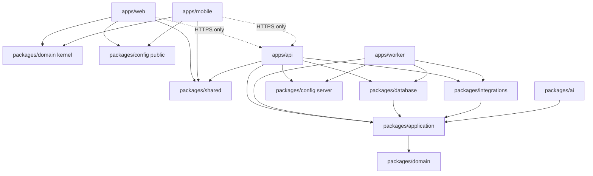

# 001 Foundation Plan

- Status: PLAN, approved in principle 2026-09-27 (not an ADR). Application decisions are recorded in
  `docs/decisions/ADR-002-application-foundation.md` (ACCEPTED 2026-09-27), which takes precedence over this plan where
  they differ. AWS topology belongs to ADR-003. Nothing is provisioned until ADR-001 and ADR-003 are accepted.
- Date: 2026-09-27 (refined 2026-09-27: refinements R-1 to R-10 below)
- Inputs: `AGENTS.md`, `.cursor/rules/*`, `docs/product/*`, `docs/architecture/*`, `docs/decisions/README.md`, accepted `docs/decisions/ADR-001-aws-infrastructure.md`
- Governance check: no conflict found between the planning brief and ADR-001 or the APPROVED product decisions. One documentation inconsistency was found (section 30, R1) and has been fixed.

Refinements incorporated after approval in principle:
- R-1: `ai-principles.md` uses the canonical ports `AIProvider`, `SpeechProvider`, `DocumentProvider` (section 30, R1).
- R-2: client-safe `@tali/domain/kernel` subpath definition (sections 3, 4).
- R-3: location-bound use cases require a resolved non-null location (sections 8, 9).
- R-4: bounded, redacted audit payload schemas (section 15).
- R-5: sync ADR evaluates configuration/catalog version context on offline commands (section 13).
- R-6: mutation-protocol ADR defines canonical serialization and fingerprinting (section 14).
- R-7: provider-issued stable identifiers are the preferred deduplication source (section 14).
- R-8: Prisma conditional approval with explicit spike criteria (section 10).
- R-9: skeletal permission model only (sections 8, 28).
- R-10: worker scaffold is a composition/config/queue smoke shell only (sections 17, 28).

ADR-002 acceptance clarifications (2026-09-27):
- C-1: `apps/api` and `apps/worker` are separate processes. The in-memory queue is for tests and single-process worker
  smoke tests only. The local asynchronous path is the PostgreSQL outbox polled by the local worker (sections 17, 20).
- C-2: a CI text-integrity check enforces UTF-8 (rejects UTF-16, prohibited BOM, null bytes). `.gitattributes` is not
  encoding enforcement (sections 21, 23, 28).
- C-3: currency code `VARCHAR(3)` validated against currency reference data. Basis points only where their precision
  is sufficient; not a universal rate type (section 11).
- C-4: mobile compatibility acceptance checks for `bigint` on Expo/Hermes and a secure cross-platform UUIDv7
  implementation (section 28).

## 1. Executive summary

Tali is one TypeScript monorepo with pnpm workspaces and Turborepo. It contains:
- four applications: NestJS API, NestJS worker, Next.js web and Expo mobile;
- a layered backend core: `packages/domain` (pure), `packages/application` (use cases, authorization, ports), `packages/database` (Prisma and PostgreSQL adapters), `packages/integrations` (AWS and vendor adapters);
- narrowly scoped supporting packages: `shared` (wire contracts only), `config` (validated configuration), and `ai` and `ui` (created only when first needed).

`apps/api` and `apps/worker` are two composition roots over the same `packages/application` use cases. Neither contains domain logic, and neither calls or imports the other. Clients (web, mobile) talk only to the API over HTTPS and can never import application, database or infrastructure code. This is enforced by pnpm declared dependencies, `package.json` `exports`, dependency-cruiser and ESLint.

Key recommendations for ADR-002:
- **Money:** `bigint` integer minor units, with a string wire format.
- **IDs:** UUIDv7.
- **Data access:** Prisma, confined to `packages/database`, with a raw-SQL policy.
- **Testing:** Vitest (Jest for mobile), Supertest and Playwright.
- **Boundaries:** enforced by dependency-cruiser.
- **Local development:** Docker PostgreSQL only; local/test adapters for identity, storage and queues; no LocalStack; no AWS needed for development or tests.

The scaffold contains no business features: workspace, tooling, boundaries, CI, config, ports and fakes, database plumbing, app shells, health endpoints and smoke tests. AWS topology stays in ADR-003, and nothing is provisioned until ADR-001 and ADR-003 are both accepted. No product decision needs resolving before the scaffold.

## 2. Exact repository tree

Target after the scaffold. Items marked (later) are not created in the scaffold.

```
tali-monorepo/
  AGENTS.md
  README.md
  .cursor/                      existing rules, BUGBOT.md
  docs/
    product/  architecture/  decisions/
    plans/001-foundation-plan.md
  .github/
    workflows/ci.yml
    CODEOWNERS                  (optional; protects governance + boundary config)
  .gitattributes                line endings only (LF); not encoding enforcement
  .gitignore  .editorconfig  .nvmrc  .npmrc  .env.example
  package.json                  root scripts only; packageManager pinned (corepack)
  pnpm-workspace.yaml
  pnpm-lock.yaml
  turbo.json
  docker-compose.yml            PostgreSQL only (local dev + local integration tests)
  .dependency-cruiser.cjs       package + module boundary and cycle rules
  eslint.config.mjs             root flat config using tooling/eslint
  prettier.config.mjs
  tooling/
    typescript/                 tsconfig presets: base, node-lib, nest-app, nextjs, expo
    eslint/                     shared ESLint rules incl. restricted imports
    text-integrity/             CI check: UTF-8 only, no UTF-16, no prohibited BOM, no null bytes
  apps/
    api/
      src/
        main.ts
        app.module.ts
        composition/            wires packages/application use cases with adapters
        interface/http/<module>/  controllers, request/response mapping (per module, later)
        auth/                   authentication guard, BusinessContext resolver
        health/                 /health/live, /health/ready
        observability/          logger, correlation-id middleware, error filter
      test/                     Supertest integration tests
    worker/
      src/
        main.ts                 Nest standalone application context (no HTTP server)
        composition/
        handlers/<module>/      job/message handlers (later)
        outbox/                 outbox relay loop (after mutation-protocol ADR)
        health/                 heartbeat / readiness for ECS
      test/
    web/
      src/app/                  Next.js App Router routes
      src/features/             feature UI (later)
      src/lib/api-client/       typed client over packages/shared contracts
      src/lib/auth/             client sign-in adapter (Cognito client library; later)
      test/  e2e/               Vitest + RTL; Playwright
    mobile/
      app/                      Expo Router screens
      src/features/             (later)
      src/lib/api-client/
      src/lib/auth/             (later)
      src/offline/              SQLite command queue (later, after sync ADR)
      test/
  packages/
    domain/
      src/kernel/               money, currency, quantity (later), ids, time, result/errors
      src/modules/<module>/     entities, value objects, invariants, state machines (later)
    application/
      src/context/              BusinessContext, Actor, SourceChannel
      src/authorization/        permission catalogue, policy evaluation
      src/ports/                identity, object-storage, queue, clock, id-generator,
                                unit-of-work, audit-recorder, outbox-writer, idempotency-store
      src/modules/<module>/     use cases + module repository ports (later)
      src/testing/              in-memory fakes of every port (subpath export ./testing)
    database/
      prisma/schema/            multi-file schema, one file per module (later tables)
      prisma/migrations/
      src/client/               Prisma client lifecycle
      src/unit-of-work/         transaction runner implementing the port
      src/modules/<module>/     repository adapters (later)
      src/testing/              test database helpers
    integrations/
      src/aws/cognito/  src/aws/s3/  src/aws/sqs/     (later, with ADR-003)
      src/local/identity/  src/local/object-storage/  src/local/queue/
      src/providers/            payment, banking, messaging, speech, document, ai (later)
    shared/
      src/contracts/http/       health, error envelope, (later) per-module DTO schemas
      src/contracts/sync/       offline command envelope (later)
    config/
      src/server/               server config schema + loader (api, worker)
      src/public/               public web/mobile config schemas
    ai/                         (later: AI milestone)
    ui/                         (later: only when a second consumer needs shared UI)
  infrastructure/
    cdk/                        (later: only after ADR-001 AND ADR-003 are ACCEPTED)
```

## 3. App responsibilities

- **apps/api (NestJS)**
  - Responsibility: the HTTP transport and composition root. Authenticate, resolve `BusinessContext`, validate input with `packages/shared` schemas, map to application commands, invoke exactly one application use case, map results and errors, handle webhook intake (verify, persist, enqueue).
  - Allowed: `application`, `domain`, `database`, `integrations`, `config/server`, `shared`, `ai` (later), NestJS.
  - Forbidden: other apps, `ui`, `config/public` secrets mixing, direct Prisma use in controllers, AWS SDK outside `integrations`.
  - Authoritative business logic: **no**.
- **apps/worker (NestJS standalone context)**
  - Responsibility: the asynchronous composition root. Run the outbox relay and queue consumers, rebuild `BusinessContext` from the database, and invoke the **same** application use cases as the API. Jobs include extraction, transcription, webhook processing, notifications, reconciliation backfills and retention.
  - Allowed: same as `apps/api` minus HTTP controllers.
  - Forbidden: importing `apps/api`, calling the API over HTTP, writing repositories directly from handlers.
  - Authoritative business logic: **no**.
- **apps/web (Next.js)**
  - Responsibility: merchant configuration, imports, reconciliation, reporting and admin review. Presentation only; calls the API.
  - Allowed: `shared`, `config/public`, `ui`, `domain/kernel` (display formatting only), a Cognito client sign-in library isolated in `src/lib/auth`.
  - Forbidden: `application`, `database`, `integrations`, `config/server`, `ai`, Prisma, AWS service SDKs, AWS credentials, server-only env vars. Next.js server components/route handlers must not become a second backend: they may only proxy/render API data, never hold business rules or database access.
  - Authoritative business logic: **no**.
- **apps/mobile (Expo, Android-first)**
  - Responsibility: the primary operating interface; later the offline command capture and sync client.
  - Allowed: same as web, plus `domain/kernel` for the offline arithmetic that `architecture-principles.md` section 6 permits. The server recomputes and verifies it. The kernel contains no authorization rules, posting logic or commit-capable state transitions (section 4).
  - Forbidden: same as web.
  - Authoritative business logic: **no**. The device records commands; the backend decides.

## 4. Package responsibilities

- **packages/domain**
  - Responsibility: pure business concepts: entities, value objects (Money, CurrencyCode, Quantity, identifiers, BusinessDate), invariants, state machines, deterministic rules (e.g. posting rules, later).
  - Allowed: no internal packages. Third-party dependencies are minimal and pure (none expected initially).
  - Forbidden: NestJS, Prisma, AWS SDK, HTTP, queues, Zod-as-transport, `Date.now()` / randomness (inject clock and IDs), `number` money.
  - Authoritative logic: **yes** (rules), but it performs no I/O.
  - Exports: `.` (backend use) and `./kernel` (client-safe primitives). Clients may import `./kernel` only.
  - **Client-safe kernel contract** (`@tali/domain/kernel`): only pure value objects (Money, CurrencyCode, Quantity,
    identifiers, BusinessDate) and deterministic arithmetic, rounding, allocation and formatting primitives. It must
    **not** export authorization rules, posting logic, commit-capable state transitions, or any other authoritative
    business operation. Client results are provisional; the server recomputes and validates every authoritative
    effect. The kernel may not import from `modules/`, enforced by dependency-cruiser.
- **packages/application**
  - Responsibility: the use-case layer shared by the API and worker: use cases, authorization policies, transaction orchestration (unit of work), idempotency handling, audit and outbox calls, repository and provider **port interfaces**, read/query services, proposal services.
  - Allowed: `domain`; Zod for validating commands at the use-case boundary where useful.
  - Forbidden: NestJS (no decorators; wired via factory providers in apps), Prisma types, AWS SDK, HTTP types, `shared` wire contracts (the apps map wire to commands), `config` (values are injected).
  - Authoritative logic: **yes** (orchestration, authorization, transactions).
  - Exports: `.`, `./testing` (fakes; test and local composition only), and later `./queries` and `./proposals` (the only entry points `packages/ai` may use).
- **packages/database**
  - Responsibility: Prisma schema, migrations and client; PostgreSQL implementations of repository ports, unit of work, audit recorder, outbox writer, idempotency store and the outbox relay reader.
  - Allowed: `application` (ports), `domain`, Prisma, `pg` if needed.
  - Forbidden: `integrations`, apps, NestJS, AWS SDK, `shared`. Prisma types never leave this package; adapters map rows to domain/application types.
  - Authoritative logic: **no**. It persists; it does not decide.
- **packages/integrations**
  - Responsibility: external adapters implementing application ports: Cognito, S3, SQS (later), local/dev adapters (local identity, local filesystem storage), future providers (payment, banking, messaging, speech, document, AI).
  - Allowed: `application` (ports), `domain`, AWS SDK v3, vendor SDKs.
  - Forbidden: `database`, apps, NestJS, Prisma. AWS or vendor types never appear in exported signatures.
  - Authoritative logic: **no**.
- **packages/shared**
  - Responsibility: **wire contracts only**: Zod schemas and inferred types for HTTP request/response DTOs, the error envelope, the offline command envelope, and user-visible state enums (sync/UI states).
  - Allowed: Zod only.
  - Forbidden: every internal package, business logic, "utils".
  - Authoritative logic: **no**.
- **packages/config**
  - Responsibility: environment configuration schemas and loaders. `./server` is for API and worker; `./public` is for web and mobile.
  - Allowed: Zod.
  - Forbidden: internal packages; clients importing `./server`.
  - Authoritative logic: **no**.
- **packages/ai** (created at the AI milestone)
  - Responsibility: AI orchestration: prompt templates (versioned), extraction output schemas, tool definitions and evaluation harness. It produces proposals via application proposal services.
  - Allowed: `application/queries`, `application/proposals`, `domain`.
  - Forbidden: `database`, `integrations` (model access goes through the `AIProvider` port), commit use cases.
  - Authoritative logic: **no**.
- **packages/ui** (created only when needed)
  - Responsibility: design tokens, and components shared by the same platform family.
  - Forbidden: `application`, `database`, `integrations`, `config/server`, API clients. Sharing React DOM and React Native components is not assumed.

Junk-drawer prevention: `shared` holds contracts only (no `utils/`). A shared export must have at least two consumers. Pure business primitives go in `domain/kernel`, not `shared`. Code used by one app stays in that app.

## 5. Dependency rules



Prohibited edges and how each is prevented:
- `web`/`mobile` -> `database`, `application` or `integrations`: not declared as dependencies (pnpm strict resolution), plus dependency-cruiser `forbidden` rules and ESLint `no-restricted-imports`.
- `ai` -> `database`, or AI -> commit use cases: `ai` may import only `application/queries` and `application/proposals` (package `exports` plus a dependency-cruiser path rule).
- Integration adapter -> ledger tables: `integrations` cannot depend on `database`. Inbound provider events reach the ledger only by calling application use cases.
- Worker bypassing application services: worker handlers may import only `application` use cases and composition. A dependency-cruiser rule forbids `apps/worker/src/handlers/**` from importing `packages/database/**` (only `composition/` may).
- Controllers touching Prisma: a dependency-cruiser rule forbids `apps/api/src/interface/**` -> `packages/database`.
- Inward direction: `domain` has no internal dependencies; `application` depends only on `domain`; nothing depends on apps.
- Cycles: dependency-cruiser `no-circular` across packages and modules, failing in CI.
- Vendor SDK containment: `@aws-sdk/*` and other vendor SDKs are allowed only in `packages/integrations`; `@prisma/client` only in `packages/database`; `@nestjs/*` only in `apps/api` and `apps/worker`.

Recommended enforcement stack: pnpm strict workspace dependencies (first line), `package.json` `exports` (limits subpaths), **dependency-cruiser** (single source of truth for package and module rules, plus cycles, in CI), and ESLint restricted imports (fast editor feedback). Turborepo's boundaries feature is not relied on.

## 6. Modular-monolith boundaries

The same module folders appear in `domain`, `application` and `database`. A module's public surface is `modules/<module>/index.ts` in each package. Deep imports into another module are forbidden by dependency-cruiser. Cross-module effects go through the other module's exported use cases/ports within one unit of work, or through outbox events.

Planned modules (not implemented):
- `identity`: User, UserIdentity (external identity-provider subject), BusinessMembership, roles and permissions, Device registration and status.
- `business`: Business profile, currency (ISO 4217), IANA time zone, settings.
- `location`: BusinessLocation. Business creation calls location's use case to create the single active default location in the same transaction.
- `catalog`: products, variants, prices and price history.
- `inventory`: movements (canonical types), on-hand derivation, counts, restock (`PURCHASE_RECEIPT`).
- `customer`: customer records.
- `sales`: sales, returns, receipts, line snapshots.
- `payments`: payments received and made, payment methods, allocations.
- `receivables`: customer credit and balances.
- `accounting`: chart of accounts, journal entries, posting, periods, and configurable tax treatment as a sub-area. No tax logic in the foundation.
- `daily-close`: cash sessions, counts, variances, summary.
- `supplier` and `purchasing`: suppliers; purchase orders, goods receipts, supplier invoices, supplier payments, payables, returns.
- `reconciliation`: evidence matching, reconciliation states.
- `capture`: evidence records and stored-object metadata (receipts, invoices, delivery notes, voice notes, screenshots).
- `ai-proposals`: Proposal records and lifecycle. AI orchestration itself lives in `packages/ai`.
- `integrations`: provider connections, inbound raw events, outbound instruction records.
- `audit`: audit records.
- `sync` (added; required by `architecture-principles.md` section 7): offline command inbox and lifecycle.

Naming note: `architecture-principles.md` uses indicative names (`customers`, `ledger`, `suppliers`/`purchasing`, `tax`). ADR-002 should confirm the final module names and update that table.

Layer placement:
- **Domain:** entities, value objects, invariants, state machines (`draft -> posted -> reversed`), posting rules, stock policy evaluation, domain event types.
- **Application:** use cases, permission checks, unit-of-work boundaries, idempotency, audit and outbox calls, repository and provider ports, query services, proposal services.
- **Infrastructure** (`database`, `integrations`): Prisma models and repositories, SQL and locks, the outbox table, the audit table, JWT verification, S3 signing, SQS I/O, vendor payload mapping.
- **Shared:** HTTP/sync wire schemas and user-visible enums only.

Implication: module table ownership spans three packages. It is enforced by folder symmetry, dependency-cruiser module rules and review. Prisma multi-file schema files are organized per module. PostgreSQL schemas per module are optional and deferred.

## 7. Authentication design

Cognito authenticates; Tali authorizes.

- **Client sign-in:** web and mobile obtain Cognito tokens through a client sign-in library isolated in `src/lib/auth`. The sign-in UX (hosted vs custom UI, phone vs email, OTP, SMS delivery in Nigeria) is **not decided**; it belongs to ADR-003. Clients never hold AWS credentials; they send `Authorization: Bearer <access token>` to the API.
- **Token validation:** in the API (guard) via the `IdentityProvider` port, `verifyAccessToken(token) -> VerifiedIdentity { provider, subject, issuedAt, expiresAt, authTime }`. The Cognito adapter in `integrations/aws/cognito` verifies signature (cached JWKS), issuer, `token_use=access`, client ID and expiry. No Cognito types leave the adapter.
- **Subject to Tali User:** `user_identities (provider, provider_subject)` is UNIQUE and references `users.id` (a Tali UUID). Users are never matched by email or phone. User creation and linking flows follow the sign-in UX decision.
- **Local/test IdentityProvider:**
  - `FakeIdentityProvider` (in `application/testing`) maps opaque test tokens to subjects in memory for unit and integration tests.
  - `LocalIdentityProvider` (in `integrations/local`) signs JWTs with an ephemeral local key pair. It has a dev-only sign-in endpoint mounted only when `TALI_ENV=local`.
  - Config validation rejects `IDENTITY_PROVIDER=local|fake` in development, staging and production, and a CI test asserts this.
- **Revocation:** Cognito access tokens remain valid until expiry. Tali therefore checks membership status, user status and device status on every request, so revocation takes effect immediately inside Tali regardless of token lifetime.

## 8. Authorization design

- **BusinessContext:** `{ businessId, locationId?, actor { userId, membershipId, type }, permissions, deviceId?, sourceChannel, correlationId, currency, timeZone }`. It is resolved server-side once per request, job or event and passed explicitly to use cases.
- **Active business:** selected by the route (`/v1/businesses/:businessId/...`, per `50-api.mdc`). The path value is a claim. The resolver loads an **active** `BusinessMembership` for (user, business), or responds `404`.
- **Location:** the generic `BusinessContext` may carry an optional `locationId`. Any location-bound use case (sales,
  inventory, receiving, cash sessions and cash close) receives a **resolved, non-null location** as a required input
  (e.g. a `LocationBoundContext` with `locationId: LocationId`). It never runs with a missing location. A `locationId`
  in input is verified to belong to the business. When none is supplied, default-location resolution (MVP: the
  business's single active default location) happens server-side **before** the location-bound use case is invoked,
  not inside it.
- **Device:** mobile requests carry a device ID. The resolver checks that the device is registered to the business and active. The registration and binding mechanism is in the sync/device ADR.
- **Permissions:** a code-defined catalogue (e.g. `sales:void`, `inventory:adjust` as naming examples only); roles map to permission sets stored per membership. **The foundation keeps the model skeletal**: permission type, catalogue mechanism and evaluation function only. No feature permissions are predefined before their use cases exist; each feature adds its permissions with its use cases. The NestJS guard enforces authentication and context. Use cases re-check the specific permission (default deny, defense in depth). Offline capability is a per-operation permission attribute whose **default values are unresolved** (open decision 3).
- **Why Cognito claims never decide tenancy by themselves:**
  - Groups and attributes are pool-wide, not per-business.
  - Claims are stale until token refresh, so revocation would lag.
  - Pool changes happen outside Tali's audited transactions.
  - Staff roles and device status are business data that must be audited.
  - The database membership is the single audited source of truth.

## 9. Multi-tenancy design

- **Tables (planned, not created):**
  - `businesses (id, currency, time_zone, status)`.
  - `business_locations (business_id, id, is_default, status)`, with a partial unique index guaranteeing one active default per business.
  - `users` (global; not tenant-owned).
  - `user_identities`.
  - `business_memberships (business_id, user_id, role, status)`, UNIQUE(business_id, user_id).
  - `devices (business_id, id, status, registered_by, revoked_at)`.
- **Relational enforcement:** every tenant-owned table has `business_id NOT NULL` and `UNIQUE (business_id, id)`. Child references use **composite foreign keys** `(business_id, x_id) -> parent(business_id, id)`, so the database itself rejects cross-tenant references. Repository methods always take `businessId`.
- **API:** the context resolver (section 8) validates every related ID's business. Location-bound use cases receive a resolved, non-null location (section 8).
- **Background jobs:** outbox messages and queue envelopes carry `businessId`, `actor`, `correlationId` and `idempotencyKey`. The worker re-validates that the business is active (and the membership for user-initiated work) before invoking a use case.
- **S3 objects:** `stored_objects (business_id, id, object_key, purpose, content_type, byte_size, checksum, retention_class, status, created_by)`. The key format `businesses/{businessId}/{purpose}/{objectId}` is provenance only. Access is granted only via an API endpoint that loads `(business_id, id)` after a permission check and then issues a signed URL.
- **Offline mobile state:** one SQLite database per (business, user) partition. Logout clears the partition per retention policy, and unsynced commands are never silently dropped. Synced commands are authorized against **current** server membership and device status.
- **Row-Level Security:** only as defense in depth.
  - Pros: catches missed filters.
  - Cons with Prisma: requires `SET LOCAL app.business_id` inside every transaction (client extension plus interactive transactions), creates pooling pitfalls, complicates the cross-tenant outbox relay, and adds migration-role complexity.
  - Recommendation: build the schema RLS-ready (business_id everywhere, non-owner app role without BYPASSRLS). Do not enable RLS in the scaffold. Revisit with a spike before the pilot for high-risk tables. Application authorization remains mandatory either way.

## 10. Database/data-access design

- **Prisma evaluation:**
  - Benefits: generated TypeScript types, readable schema, `migrate` workflow, interactive transactions with isolation level, `BigInt` maps to `bigint`, wide adoption.
  - Limitations for Tali:
    - CHECK, partial-index, exclusion and deferred constraints, RLS policies and privilege grants need hand-written SQL in migrations.
    - `SELECT ... FOR UPDATE` / `SKIP LOCKED` need `$queryRaw`.
    - Interactive transactions hold a connection and have timeouts.
    - Nested writes can hide statement order.
    - `delete`/`deleteMany` exist, so they are banned by lint on protected models and revoked at the database level.
    - `bigint` is not JSON-serializable.
    - Connection pool sizing with Fargate tasks against RDS (see ADR-003).
- **Financial transaction support:** one `UnitOfWork.run(ctx, fn)` wraps `$transaction` (interactive, isolation per use case, default READ COMMITTED plus explicit row locks, SERIALIZABLE where justified). The mutation, postings, movements, audit record, idempotency record and outbox message commit together.
- **Migration workflow:**
  - Local: `prisma migrate dev` generates SQL. The developer reviews it and appends constraints and grants in the same migration.
  - Migrations are committed and forward-only; never edited after reaching a shared environment.
  - CI: apply all migrations to an empty PostgreSQL, run a drift check (schema vs migrations), and run a protected-table destructive-SQL check.
  - Deployed environments: `prisma migrate deploy` as a one-off task with a migration role separate from the app role (execution mechanism in ADR-003). Never `db push` or `migrate reset` outside local.
- **Raw SQL escape hatch:** only inside `packages/database`, only as parameterized tagged templates (`$queryRaw`). `$queryRawUnsafe` is banned. It is justified for row locks, `SKIP LOCKED` relay, reporting aggregates, RLS session settings, and constraints and grants in migrations.
- **DB roles:** a migration owner role; an app role with no DELETE on financial or audit tables and no UPDATE on audit and append-only tables (REVOKE, not triggers); later, a read-only role for reporting and support.
- **Environments:** local (Docker `tali_local` plus `tali_test`), development, staging and production (separate RDS instances, later separate accounts). No environment shares an authoritative database. Production data is never copied down without an approved anonymization process.
- **Recommendation for ADR-002:** approve Prisma **conditionally**: confined to `packages/database`, explicit mapping,
  raw-SQL policy, DB-level grants. The foundation database spike (scaffold step 7) must prove all of:
  1. interactive transactions (multi-statement, rollback on error, configurable isolation level);
  2. row locking with `SELECT ... FOR UPDATE` inside an interactive transaction;
  3. `FOR UPDATE SKIP LOCKED` batch claiming with concurrent workers;
  4. `BigInt` round trip (PostgreSQL `BIGINT` to TypeScript `bigint` and back, without precision loss or `number` coercion);
  5. custom SQL migrations (CHECK constraints, partial unique indexes, grants/REVOKE) applied by `migrate deploy`
     without drift errors;
  6. multi-file schema organized per module;
  7. repository mapping with **no Prisma types escaping `packages/database`** (verified by dependency-cruiser and
     type-level checks on exported signatures).
  If any criterion fails materially, Kysely or Drizzle may be reconsidered **before Build 1**, with the outcome
  recorded as an amendment or a superseding ADR.
- No business schema is created in the foundation.

## 11. Money recommendation

- **Recommendation (ADR-002):** authoritative amounts are **integer minor units**, `bigint` in TypeScript and `BIGINT` in PostgreSQL, always paired with an ISO 4217 currency code stored as `VARCHAR(3)`, constrained or validated against the approved currency reference data when that schema is implemented.
  - The domain `Money { amountMinor: bigint, currency: CurrencyCode }` lives in `domain/kernel`.
  - Minor-unit exponent comes from global currency reference data (seeded, read-only), never a hard-coded `100`.
  - Operations across different currencies throw; there is no FX.
  - Integer basis points are used for current simple percentage calculations (simple discounts, configurable tax rates) where their precision is sufficient. They are not the universal rate representation; future lending, interest, APR or other advanced financial products may introduce a separately approved higher-precision `Rate` type.
  - Rounding uses explicit named modes (`HALF_EVEN`, `HALF_UP`) at call sites with integer arithmetic.
  - Allocation uses largest remainder so parts always sum to the whole.
  - NGN appears only as pilot configuration or seed data.
- **Compared with Decimal:** PostgreSQL `NUMERIC` with Prisma `Decimal` (decimal.js) is exact, but it introduces object types across layers, scale mismatches, slower arithmetic, awkward serialization, and a second representation beside the governance default. Minor units already match `data-principles.md` section 2 and the rules.
- **Known limit:** sub-minor precision (e.g. per-unit cost derived from pack cost) is not needed for authoritative amounts. If inventory valuation needs it, an exact fixed-scale `NUMERIC` for **derived unit costs only** is decided with the valuation ADR (allowed by `10-database.mdc` via ADR).
- **Wire format:** `{ "amountMinor": "125050", "currency": "NGN" }`. The amount is a base-10 integer string (no JSON numbers for money, avoiding precision loss and bigint serialization issues). ADR-002 should confirm this reading of `50-api.mdc` ("integer minor units or decimal string").
- Tax logic is out of scope.

## 12. Time/date strategy

- **Server UTC:** all instants are `timestamptz` in UTC. The server clock (injected `Clock` port) is the only clock used for security decisions: token expiry, revocation, idempotency expiry and authorization.
- **Business time zone:** an IANA zone on `businesses.time_zone` (configuration, not hard-coded). Changes are audited and never recompute existing `business_date` values.
- **`occurred_at`:** when the business event happened, as recorded.
  - Online capture: the server time at receipt.
  - Offline capture: taken from the device-reported time as evidence. How implausible device times are handled is a sync-ADR policy.
- **`device_reported_at`:** the raw device clock claim, stored verbatim; evidence only. It never drives authorization.
- **`received_at`** (sync envelope): when the server first received the command (`SYNC_RECEIVED`).
- **`recorded_at`:** when Tali durably recorded or posted it (transaction time).
- **`business_date`:** a `DATE` in the business time zone for the occurrence. For offline commands it is computed on the device with the business's synced time zone (not the device zone), then validated server-side. It is immutable once posted.
- **Late sync:** keeps `occurred_at` and `business_date`, gets a new `recorded_at`, and is never rewritten into "today". How it interacts with a closed daily close (open decision 8) and closed accounting periods (accounting ADR) is decided later.

## 13. Offline foundation

Architectural support only; no sync implementation.
- **Device:** SQLite (candidate: `expo-sqlite`, with at-rest encryption where the platform allows; choice in the sync ADR). One database per (business, user) partition.
- **Command envelope** (future `shared/contracts/sync`): `commandId` (client UUIDv7, idempotency key and transaction identity), `commandType`, `schemaVersion`, `businessId`, `locationId`, `userId`, `deviceId`, `deviceSequence` (per-device monotonic order), `deviceReportedAt`, `businessDate`, `payload`, snapshots of price/discount/tax.
- **Local queue:** a command is persisted before the UI confirms. States are `LOCALLY_RECORDED -> SYNC_RECEIVED -> VALIDATED -> POSTED`, or `CONFLICT -> NEEDS_ATTENTION`, or `REJECTED` (permitted reasons only), mapped to UI states per `reconciliation-principles.md` section 4.
- **Server:** a `sync` module inbox `sync_commands (business_id, command_id UNIQUE, request_fingerprint, status, reason, result_ref)`. Commands are processed through the same application use cases. A per-command acknowledgment returns the status. Device order is preserved; cross-device late or out-of-order arrival is tolerated.
- **Device registration and revocation:** the `devices` table plus per-request and per-command status check.
- **Configuration context (sync ADR note):** the future sync ADR must evaluate whether offline commands need to retain
  the configuration and catalog context they were captured against, for example `catalogVersion`, `pricingVersion`
  or `businessConfigVersion`, so the server can distinguish stale-configuration conflicts from invalid commands.
  These fields are **not** implemented in the foundation.
- **Unresolved dependencies** (not decided here): open decisions 1, 2, 3, 4, 8, 9 and 15, plus sync ADR items (receipt number format, device binding, local encryption, plausibility rules, configuration/catalog version context).

## 14. Idempotency

One protocol for all mutation entry points (detailed in the mutation-protocol ADR before the first mutating use case):
- **Store:** `idempotency_records (scope, key, request_fingerprint, status, response_ref, created_at, expires_at)`, UNIQUE (scope, key). The scope is `business_id` plus operation for API calls, and `business_id` for offline commands. The fingerprint is a hash (e.g. SHA-256) of the canonicalized, validated command plus operation name and schema version. **The mutation-protocol ADR must explicitly define the canonical serialization and fingerprinting algorithm**: key ordering, Unicode normalization, number/`bigint`/decimal-string representation, date/time formats, absent vs `null` vs default values, array ordering semantics and schema-version handling. `JSON.stringify` is **not** assumed to be a sufficient canonicalization algorithm. The record is written **in the same transaction** as the effect; concurrency is resolved by the unique constraint.
- **Same key, same payload:** return the original result (same status and body, marked as a replay). If the original is still in progress, return a retryable conflict.
- **Same key, different payload:**
  - API: reject (`409`/`422` per `50-api.mdc`; ADR-002 picks one code).
  - Offline command: `REJECTED` as a tampered/corrupted payload, with a security audit event.
- **Deterministic rejections** are stored so replays are consistent. Transient failures are not stored, so a retry can succeed.
- **Applied to:**
  - Mobile retries: `commandId`.
  - API retries: the `Idempotency-Key` header.
  - Provider/webhook retries: `inbound_events` UNIQUE (provider, external_event_id). **Provider-issued stable event or
    transaction identifiers are the preferred deduplication source.** A content hash is only a provider-specific
    fallback, adopted per provider after explicit review (documented in that provider's ADR). It is never a universal
    deduplication rule.
  - Worker retries: `processed_messages` UNIQUE (consumer, message_id) in the same transaction as the handler's effects, plus the originating idempotency key propagated to the use case.
  - Outbound money movement (future): a persisted instruction plus a provider idempotency key.

## 15. Audit model

- `audit_records` (PostgreSQL, insert-only for the app role): `id`, `business_id`, `location_id?`, `occurred_at` (UTC), actor type and ID (user, staff, system job, integration, AI proposal plus approving user), `device_id?`, `action` (`sale.posted`), resource type and ID, `source_channel`, `correlation_id`, `idempotency_key?`, `proposal_id?`, `external_event_id?`, `reason?`, `before`/`after` (or diff) where appropriate.
- Written through the `AuditRecorder` port inside the same unit of work as the mutation.
- **Payload safety:** `before`/`after` data uses **bounded, purpose-specific, redacted schemas** defined per audit
  action (e.g. the changed fields of a price change, a role grant's role and grantee). Complete entities are **never**
  automatically serialized into audit records. Secrets, tokens, credentials, raw media or document content, full
  account/card numbers and unnecessary sensitive personal attributes are never copied into audit payloads; media
  and evidence are referenced by ID. Payload size is capped, and audit schemas are reviewed like API contracts.
- **Distinctions:**
  - **Business data:** current-state tables (products, customers); authoritative state.
  - **Financial ledger:** append-only journal entries and lines; the accounting truth from which balances derive.
  - **Audit records:** who did what, when, why, with before and after. Never used to compute balances; never replayed to rebuild state.
  - **Operational logs:** CloudWatch structured logs with correlation IDs; bounded retention; no secrets or PII; not a business record.
- Not event sourcing: state tables remain authoritative.

## 16. Object-storage design

- **Port (`application/ports/object-storage`, Tali terms only):**
  - `createUploadTarget({ objectKey, contentType, maxBytes, expiresInSeconds })`
  - `createDownloadUrl({ objectKey, expiresInSeconds })`
  - `getObjectInfo(objectKey)`
  - `putObject` (upload-through mode)
  - `deleteObject` (retention jobs only)
- **Adapters:** S3 (`integrations/aws/s3`, later); local filesystem with HMAC-signed short-lived dev URLs served by the API only when `TALI_ENV=local`; in-memory fake for tests.
- **Metadata:** the `capture` module's `stored_objects` (section 9) holds status (`pending_upload -> uploaded -> validated -> rejected`), `retention_class` (periods unresolved, open decision 14) and a `training_use` policy fixed to prohibited (no automatic training reuse; provider terms by ADR).
- **Guarantees:** private by default; access only after API authorization; key prefixes are not authorization; short-lived, single-object, single-operation URLs.
- **Direct-to-S3 via API-issued signed URLs:**
  - Pros: removes upload bandwidth and memory from Fargate, scales better on slow mobile networks, and a presigned POST can enforce size.
  - Cons: two-step flow (request, upload, confirm), orphaned pending objects (needs lifecycle cleanup), type spoofing (needs server-side content validation by the worker), CORS for web, local parity handled by the local adapter.
- **Upload through NestJS:**
  - Pros: single enforcement point, validation before storage, simplest locally.
  - Cons: API bandwidth, memory and timeouts; slow mobile uploads tie up tasks; higher cost.
- **Leaning:** direct-to-S3 with a size-limited presigned POST, objects `pending` until confirmed and validated. The **final decision belongs to ADR-003**. The port supports both.

## 17. Async/outbox design

- **Outbox:** `outbox_messages (id, business_id, type, schema_version, payload, correlation_id, available_at, attempts, status, last_error, created_at, published_at)`. Written via `OutboxWriter` in the same unit of work as the business change.
- **Relay** (in the worker): batches with `FOR UPDATE SKIP LOCKED`, publishes via `QueueProvider`, marks published, backs off on failure.
- **Consumers:** worker handlers dedupe via `processed_messages`, rebuild `BusinessContext`, invoke application use cases.
- **Deployed:** SQS as transport. Standard vs FIFO (e.g. MessageGroupId per business), dead-letter queues and visibility timeouts are ADR-003 items.
- **Processes:** `apps/api` and `apps/worker` are separate processes, locally and deployed.
- **Local** (once the mutation/outbox implementation exists): API/application mutation -> PostgreSQL transactional
  outbox (same transaction) -> the local worker polls and claims outbox rows -> the worker invokes the appropriate
  application handler/use case. Durability comes from PostgreSQL. No SQS or LocalStack locally; SQS remains the
  deployed transport per ADR-001/ADR-003.
- **In-memory/in-process `QueueProvider`:** only for unit tests, port contract tests and worker smoke tests within one
  process (plus a deterministic `drainOutbox()` test helper later). It is never a cross-process channel between the
  local API and worker.
- **Future jobs:** document extraction, speech transcription, provider webhook processing (the API persists the raw event and enqueues in one transaction, then acknowledges fast), notifications, reconciliation backfills, retention cleanup.
- **Scheduling:** periodic jobs need a trigger. Options are a worker-internal scheduler with a PostgreSQL advisory-lock leader, or an AWS scheduler service (not in ADR-001's list; ADR-003 decides).
- **Foundation scope:** the outbox, `processed_messages` and idempotency tables are **not** created in the scaffold. They
  are created only after the mutation-protocol ADR. The scaffold worker is a composition/config/queue smoke shell.
- **Redis/BullMQ:** not needed. SQS plus the outbox cover retries, delays (SQS up to 15 minutes, `available_at` beyond), DLQs and fan-out. No concrete requirement exists.

## 18. Provider ports/adapters

- **Ports** are declared in `packages/application/src/ports/` (cross-cutting) or `modules/<module>/ports/` (module-specific):
  - `IdentityProvider`, `ObjectStorageProvider`, `QueueProvider` (now).
  - `Clock`, `IdGenerator`, `UnitOfWork`, `AuditRecorder`, `OutboxWriter`, `IdempotencyStore` (internal ports).
  - Future: `PaymentProvider`, `BankingProvider`, `MessagingProvider`, `SpeechProvider`, `DocumentProvider`, `AIProvider`.
- **Adapters:**
  - AWS and vendor adapters: `packages/integrations`.
  - PostgreSQL implementations (repositories, unit of work, audit, outbox, idempotency): `packages/database`.
  - Local/dev adapters: `packages/integrations/src/local`.
  - Fakes: `packages/application/src/testing`.
- **Rules:** ports use Tali vocabulary and types. AWS SDK and vendor types never cross into `application` or `domain`; adapters map payloads and errors to internal types. A port contract test suite runs against the fake and local adapters in CI, and against AWS adapters only in a later opt-in job with a development account.

## 19. Configuration strategy

- **Environment variable:** `TALI_ENV` = `local | test | development | staging | production`.
- **Server config** (`@tali/config/server`, Zod, fail-fast at startup):
  - `database` (url, pool);
  - `identity` (provider `cognito|local|fake`; user pool ID, client IDs, region);
  - `objectStorage` (provider `s3|local|memory`; bucket, region, URL expiry);
  - `queue` (provider `sqs|local|memory`; queue URLs);
  - `api` (port, CORS origins, rate limits);
  - `observability` (log level, service name);
  - `providers` (future, per-provider sections).
- **Forbidden combinations are rejected:** e.g. `production` with a `local`/`fake` identity or `memory` storage.
- **Public config** (`@tali/config/public`):
  - web: `NEXT_PUBLIC_*` (API base URL, Cognito public pool and client IDs, environment name);
  - mobile: `EXPO_PUBLIC_*` (same).
  - Cognito pool and client IDs are not secrets.
- **Secret isolation:** server-only secrets never appear in public schemas; clients cannot import `./server` (lint and boundaries); CI checks built client bundles for server variable names.
- **Secret sourcing:** local uses `.env` files (gitignored; `.env.example` committed with placeholders). Deployed environments use Secrets Manager, injected into ECS tasks or fetched at startup (ADR-003); the config module is agnostic.

## 20. Local-development workflow

- **Prerequisites:** Node.js 24 LTS (`.nvmrc`), pnpm via corepack, Docker, Android emulator or device with Expo Go / dev build.
- **Commands** (planned root scripts):
  - `docker compose up -d postgres`
  - `pnpm install`
  - `pnpm db:migrate`
  - `pnpm dev` (Turborepo runs api, worker and web)
  - `pnpm --filter @tali/mobile start` (Expo; Android emulator reaches the API via host address)
  - `pnpm test`, `pnpm test:integration`, `pnpm e2e`, `pnpm lint`, `pnpm typecheck`, `pnpm verify` (everything CI runs)
- **Adapters locally:** local identity (dev sign-in), local filesystem storage. API and worker run as separate processes; once the outbox exists, asynchronous work flows through the PostgreSQL outbox polled by the local worker (section 17). No AWS calls, no AWS credentials. Seeds are synthetic only.

## 21. Code-quality strategy

- **TypeScript:** `strict`, plus `noUncheckedIndexedAccess`, `noImplicitOverride`, `noFallthroughCasesInSwitch`, `exactOptionalPropertyTypes` (evaluate) and `verbatimModuleSyntax`. Shared presets in `tooling/typescript`.
- **ESLint** (flat config, typescript-eslint strict type-checked):
  - bans: `any`, floating promises, `parseFloat`/`toFixed` in domain/application;
  - restricted imports for vendor SDKs, Prisma and NestJS placement;
  - `$queryRawUnsafe` ban;
  - Prisma `delete`/`deleteMany` ban on protected models.
- **Prettier** for formatting (checked in CI). `.editorconfig` declares UTF-8 and LF for editors, and `.gitattributes` handles line endings. Neither is encoding enforcement.
- **Text integrity:** a CI check (`tooling/text-integrity`) verifies repository text files are UTF-8 per governance. It rejects at least UTF-16 text (including UTF-16 BOMs), a UTF-8 BOM where governance prohibits it, and null bytes in ordinary text files, with an explicit binary-asset exclusion list.
- **Boundaries:** dependency-cruiser owns package direction, module public-surface rules, worker-handler and controller rules, and `no-circular`.
- **NestJS stays in apps:** application services are plain classes wired with `useFactory` providers.

## 22. Testing strategy

- **Level 1, domain/unit** (Vitest; `packages/domain`, `packages/application` with fakes): Money, rounding and allocation; state machines; posting balance (later); authorization policies; use-case orchestration with the in-memory unit of work.
- **Level 2, API/integration** (Vitest + Supertest; real PostgreSQL via Docker locally, service container in CI; fake identity; memory storage and queue):
  - repository adapters;
  - unit-of-work atomicity;
  - idempotency concurrency;
  - worker handler and outbox drain;
  - config fail-fast;
  - port contract suites.
- **Level 3, UI/component:** web uses Vitest + React Testing Library; mobile uses Jest (`jest-expo`) + React Native Testing Library. Jest for mobile because of React Native ecosystem support.
- **Level 4, end-to-end:** Playwright for web against local API and PostgreSQL. A mobile e2e tool (e.g. Maestro or Detox) is deferred until offline sync.
- **Where future tests belong:**
  - Tenant isolation: Level 2 for every endpoint, use case and job, plus repository-level; Level 4 smoke later.
  - Financial postings: Level 1 (balance, rules) and Level 2 (single transaction with audit).
  - Inventory: Level 1 (movement rules) and Level 2 (on-hand = sum of movements, locks).
  - Idempotency: Level 2 with real PostgreSQL and concurrent duplicates.
  - Offline replay: Level 2 sync-endpoint replay and conflicts, plus Level 3 mobile queue durability with SQLite.
  - Reconciliation: Level 1 matching and state machine, plus Level 2 evidence-to-confirmation flows.
- **No AWS in normal test runs:** all ports use fakes or local adapters; no AWS credentials exist in CI.
- **Runner note:** NestJS with Vitest needs SWC for decorator metadata. If friction appears, API tests may use Jest (ADR-002 records the choice).

## 23. CI strategy

`.github/workflows/ci.yml` on pull requests and `main`:
- **Security posture:** `permissions: contents: read`; no AWS secrets; no `id-token: write` (reserved for future deploy workflows using OIDC).
- **Setup:** Node from `.nvmrc`; pnpm via corepack; `pnpm install --frozen-lockfile`; Turborepo cache via the Actions cache (remote cache optional later).
- **Jobs (parallel where possible):**
  - format check and lint;
  - typecheck;
  - boundaries (dependency-cruiser);
  - unit tests;
  - integration tests (PostgreSQL service container);
  - build (api, worker, web; mobile typecheck plus bundle export check);
  - migration validation (apply to empty DB, drift check, protected-table destructive-SQL check);
  - text integrity (UTF-8, no UTF-16, no prohibited BOM, no null bytes);
  - secret scanning (e.g. gitleaks);
  - Playwright smoke (after the web shell exists).
- **No deployment workflows.** Future deployments use GitHub OIDC roles scoped per repository, environment and branch, with manual approval for production.

## 24. Environment/deployment boundaries

- **local:** developer machine; Docker PostgreSQL; local adapters; no AWS.
- **development, staging, production:** each has its own RDS database, Cognito user pool, S3 bucket(s), SQS queues, KMS keys, secrets, ECS services, web hosting, DNS names and CloudWatch log groups. Long-term, each has its own AWS account.
- **Isolation rules:** no authoritative database sharing; no cross-environment IAM trust except CI deploy roles; no production data in lower environments without an approved anonymization process.
- **Identified for ADR-003 (not decided):** account structure, region, VPC and network, RDS configuration, Cognito configuration, S3 upload architecture, SQS configuration, ECS topology (services, task sizing, migrations task, load balancer), Amplify vs alternative web hosting.

## 25. ADR-002 recommendation: Application Foundation

Scope (decisions requiring human approval):
1. Monorepo: pnpm workspaces + Turborepo; `tooling/` for shared tooling configs.
2. Runtime: Node.js 24 LTS; pinned pnpm via `packageManager`/corepack.
3. Package set and responsibilities (sections 3 and 4), including the added `packages/application`, and `ai`/`ui` created only when needed.
4. Dependency rules and enforcement (section 5): pnpm strictness + `exports` + dependency-cruiser + ESLint.
5. NestJS for api and worker, with a framework-free domain/application layer.
6. Next.js (App Router) for web; Expo + React Native (Expo Router) for mobile.
7. Prisma as the data-access layer with the conditions in section 10, plus migration workflow and DB-role model.
8. Money: `bigint` minor units, currency reference data, rounding and allocation rules, string wire format.
9. IDs: UUIDv7 for server- and client-generated identities; implementation chosen during the scaffold spike (secure randomness, cross-platform).
10. Validation: Zod at transport and use-case boundaries.
11. Time model field semantics (section 12).
12. Testing tools: Vitest (non-React-Native), Jest (mobile), Supertest, Playwright.
13. Configuration model (server/public split, fail-fast, forbidden combinations).
14. Local development: Docker PostgreSQL, local/test adapters, no LocalStack.
15. RLS posture: RLS-ready schema, not enabled in the foundation.
16. API conventions: `/v1`, path-scoped businessId, error envelope, idempotency mismatch status code.
17. Module names (align `architecture-principles.md` section 2).

## 26. ADR-003 recommendation: AWS Foundation Topology

Required before any provisioning (with ADR-001 accepted):
- region(s) and data residency (legal review);
- account structure and IAM Identity Center;
- VPC and network (subnets, NAT vs VPC endpoints, load balancer, admin DB access);
- RDS (class, Multi-AZ, storage, backups, PITR, restore tests, RDS Proxy, roles);
- ECS topology (API/worker services, sizing, autoscaling, migrations task);
- Cognito configuration (sign-in methods, SMS for Nigeria, token lifetimes, shared-device mapping, hosted vs custom UI);
- S3 upload architecture and lifecycle;
- SQS (standard vs FIFO, DLQs, retry) and outbox deployment;
- scheduler choice;
- KMS key strategy and rotation;
- observability (log retention, metrics, alarms, tracing choice);
- CI/CD deployment (OIDC trust, environments, approvals, image scanning);
- web hosting (Amplify vs alternatives);
- backup, RPO and RTO;
- cost budgets and alerts.

Additional ADRs:
- **Before the scaffold:** none. ADR-002 is sufficient.
- **Before their features:**
  - mutation protocol (idempotency, audit, outbox) and authorization model: before the first mutating use case (identity/tenancy step);
  - ledger and chart of accounts: before sales;
  - inventory valuation: before restock with cost;
  - sync protocol, device binding and receipt numbering: before offline sync;
  - first payment provider; AI, speech and document providers; WhatsApp provider.
- Ordinary implementation details (folder names, helper libraries within approved stacks) do not need ADRs.

## 27. Open-decision dependency classification

Source: `docs/product/mvp-scope.md` "Open decisions". Classification only; none are answered here.
1. Reference Android device: **B** (before offline sync and performance testing).
2. Needs-attention workflow: **B** (sync, daily close).
3. Offline roles and limits: **B** (sync).
4. Offline credit sales and payments: **B** (sync, receivables).
5. Chart of accounts, posting rules, tax configuration: **B** (ledger, before sales).
6. Inventory valuation method: **B** (before restock with cost).
7. Discount rules: **B** (sales).
8. Daily close details: **B** (daily close, late sync).
9. Unit-of-measure and pack model: **B** (catalog, inventory; shapes the Quantity value object).
10. First payment provider: **B**.
11. WhatsApp pilot flows: **B**.
12. WhatsApp active-business selection: **B**.
13. Pilot languages: **C** (the scaffold externalizes UI strings; the language list is B for UI copy, text AI and voice).
14. Media and data retention: **C** for the foundation (retention is configurable by design); **B** before capture ships to production.
15. Device and user revocation policy: **B** (before offline sync).

None is class A.

## 28. Exact scaffold implementation sequence

Starts only after ADR-002 is ACCEPTED. No business features, no AWS adapters, no CDK.
1. **Workspace root:** `pnpm-workspace.yaml`, root `package.json` (scripts, packageManager), `.nvmrc`, `.npmrc`, `turbo.json`, `.gitignore`, `.gitattributes` (LF), `.editorconfig`, `.env.example`.
2. **Tooling:** `tooling/typescript` presets, `tooling/eslint`, Prettier, `.dependency-cruiser.cjs`. All boundary rules are written before any package code exists.
3. **CI skeleton:** install, format, lint, typecheck, boundaries, text integrity (`tooling/text-integrity`), secret scan. Every later step is gated.
4. **packages/domain:** `kernel` (Money, CurrencyCode, rounding and allocation, ids, BusinessDate) with unit tests. These are primitives, not features.
5. **packages/config:** server and public schemas, loaders, forbidden-combination tests.
6. **packages/application:** `BusinessContext` (optional `locationId`) and the location-bound context type, error types, a skeletal permission model (type, catalogue mechanism, evaluation; **no feature permissions**), ports (identity, object storage, queue, clock, ids, unit of work), in-memory fakes, and port contract test suites. Audit, outbox and idempotency ports are defined with the mutation-protocol ADR.
7. **packages/database + docker-compose:** PostgreSQL service, Prisma setup, multi-file schema folder, baseline migration (no business tables), `UnitOfWork` implementation, test-DB helpers. Includes the Prisma spike from section 10; the ADR-002 condition is verified here.
8. **packages/integrations (local only):** local identity (dev JWT) and local filesystem storage, passing the port contract suites. The in-memory queue fake (in `application/testing`) serves tests and single-process smoke tests only.
9. **packages/shared:** error envelope and health contracts.
10. **apps/api:** NestJS shell, config load, structured logging, correlation ID, error filter, `/health/live` and `/health/ready` (DB check), authentication guard using `IdentityProvider` (tested via a test-only route), Supertest integration tests. CI integration job added.
11. **apps/worker:** composition/config/queue smoke shell only. Nest standalone context, config load, graceful shutdown, heartbeat, and a consumer loop over the in-memory queue with a no-op system message smoke test within the worker process (not API-to-worker communication). No outbox relay, no outbox/processed-message/idempotency tables, no business handlers.
12. **apps/web:** Next.js shell, public config, page showing API health, Vitest + RTL test, Playwright smoke. CI build and e2e jobs added.
13. **apps/mobile:** Expo Android shell, public config, screen showing API health, jest-expo test, pnpm/Metro monorepo configuration verified. CI mobile typecheck and export added.
    **Mobile compatibility acceptance checks** (must pass before Build 1):
    - `bigint` arithmetic used by the client-safe Money kernel (construction, add, subtract, multiply, compare, rounding, allocation, string parse/format) runs correctly in the selected Expo/Hermes environment, verified on that engine, not only in Node.js;
    - the selected UUIDv7 implementation works correctly in Node.js, Next.js/browser and Expo/React Native (version and variant bits, ordering, uniqueness under bulk generation);
    - UUID generation uses a cryptographically secure random source on every platform and never falls back to insecure randomness (e.g. `Math.random`); if no secure source exists, generation fails loudly.
14. **Migration validation job and `pnpm verify`:** end-to-end local verification; README "Getting started".
15. **Deferred to their milestones:** `packages/ai`, `packages/ui`, AWS adapters (Cognito, S3, SQS; built against ADR-003 and a development account), outbox and idempotency tables (mutation-protocol ADR), SQLite offline queue (sync ADR), `infrastructure/cdk` (ADR-001 + ADR-003 accepted).

## 29. Explicit non-goals

- No business modules, tables, endpoints or UI features (catalog, sales, ledger, etc.).
- No sync implementation, SQLite queue, device registration flows or receipt numbering.
- No tax logic, chart of accounts, posting rules or inventory valuation.
- No Cognito sign-in UX decisions, no AWS adapters against real AWS, no AWS resources, no CDK, no deploy workflows.
- No Redis/ElastiCache, SES, LocalStack, Kafka, Kubernetes/EKS, graph or vector databases.
- No AI features, prompts, providers, WhatsApp or payment providers.
- No post-MVP items (Store Mode, RFID, sensors, autonomous finance, embedded finance, multi-currency, multi-country tax).
- No answers to open product decisions.

## 30. Risks and unresolved questions

- **R1, documentation inconsistency (resolved 2026-09-27):** `docs/architecture/ai-principles.md` section 8 now uses the canonical `AIProvider` / `SpeechProvider` / `DocumentProvider` ports.
- **R2, Prisma limits:** constraints and locks need raw SQL; interactive transaction timeouts; connection pressure on RDS. Mitigated by the spike and conditions; fallback is Kysely or Drizzle.
- **R3, module ownership across three packages:** relies on folder symmetry and dependency-cruiser. Drift risk; mitigated by CI rules and review.
- **R4, framework-free application layer:** NestJS factory-provider boilerplate. Accepted cost for worker reuse and portability.
- **R5, Expo/React Native in a pnpm monorepo:** Metro symlink resolution may need configuration (e.g. hoisting). Verify in scaffold step 13.
- **R6, Node 24 compatibility:** verify with Expo tooling, Prisma engines and NestJS during the scaffold.
- **R7, Vitest with NestJS decorators:** needs SWC; fallback is Jest for the API.
- **R8, `bigint` string wire format:** clients must never convert money to `number`. Needs lint rules in web and mobile.
- **R9, sub-minor unit costs:** depend on the inventory valuation ADR.
- **R10, Cognito fit:** phone/SMS in Nigeria, shared devices, staff sessions. ADR-003 risk; mitigated by Tali-owned authorization.
- **R11, region and data residency:** legal review needed before provisioning.
- **R12, line endings and encoding:** the repository currently relies on `core.autocrlf`. `.gitattributes` in scaffold step 1 fixes line endings; the CI text-integrity check (step 3) enforces UTF-8.
- **R14, Hermes/`bigint` and UUID randomness:** covered by the scaffold step 13 acceptance checks.
- **R13, Next.js server features becoming a shadow backend:** mitigated by boundary rules and review.
- **Unresolved (engineering):** API test runner choice, idempotency mismatch status code, PostgreSQL schemas per module, scheduler mechanism, mobile e2e tool, local SQLite encryption approach.
