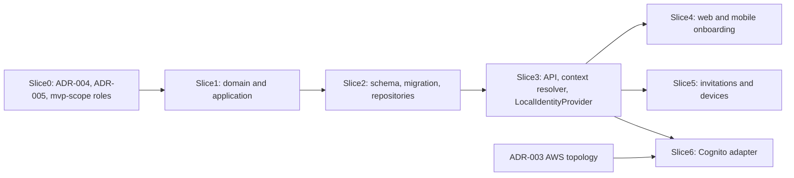

# Tali Build 1: identity, tenancy, roles and devices (plan)

Status: **APPROVED IN PRINCIPLE (2026-09-29). Slices 0, 1 and 2 complete.**
`docs/decisions/ADR-004-mutation-protocol.md` and `docs/decisions/ADR-005-identity-tenancy-authorization.md` are
**ACCEPTED (2026-09-29)**. Slice 1 found a conflict between ADR-004 section 8.3 (Zod audit schemas) and ADR-002
section 6 (application depends only on domain). `docs/decisions/ADR-006-audit-payload-schema-boundary.md` resolves it
and is **ACCEPTED (2026-09-29)**. **Slice 1 is complete (2026-09-29)**; its guidance is in section 13 and its
report in `docs/audits/build-1-slice-1.md`. **Slice 2 is complete (2026-09-29)**; its report is in
`docs/audits/build-1-slice-2.md`. The Cognito slice (Slice 6) remains blocked on ADR-003 (AWS foundation topology, reserved). Where this
plan and an ADR differ, the ADR is authoritative (`AGENTS.md` section 4).

Scope: implementation step 2 of `docs/product/mvp-scope.md` (identity / tenancy). There is no inventory, sales,
payments, accounting, purchasing, AI or offline sync in this build.

## Slices and status

| Slice | Content | Status |
|---|---|---|
| 0 | Draft ADR-004 (mutation protocol) and ADR-005 (identity/tenancy/authorization), the README index (reserve ADR-003) and the mvp-scope roles amendment. Human acceptance gate. | Complete (ADR-004 and ADR-005 accepted 2026-09-29) |
| 1 | Domain invariants, permission catalogue and role mapping, `AuthenticatedUserContext`, `authTime`, use cases with in-memory fakes and tests (guidance in section 13) | Complete (2026-09-29; `docs/audits/build-1-slice-1.md`) |
| 2 | Prisma schema and SQL migration (composite FKs, CHECKs, partial unique indexes, grants, currencies reference data), repositories, `verify-schema.mjs` expectations, integration and concurrency tests | Complete (2026-09-29; `docs/audits/build-1-slice-2.md`) |
| 3 | Auth guard and `BusinessContext` resolver, P0 endpoints, `LocalIdentityProvider` in `packages/integrations` (JWT library dependency to review), API security end-to-end tests | Not started |
| 4 | Web and mobile onboarding flows for the P0 use cases | Not started |
| 5 | P1 invitations, member management and device registration and revocation, with security tests | Not started |
| 6 | Cognito JWT verification adapter with JWKS fixtures, no AWS in CI | Blocked on ADR-003 |

## 0. Conflicts and findings

- **ADR numbering.** ADR-002 is accepted and cannot be edited, and it already refers to "ADR-003 (AWS foundation topology)" in several places, including for Cognito configuration and sign-in UX. Using ADR-003 for anything else would conflict with ADR-002.
  - ADR-003 stays reserved for AWS topology.
  - **ADR-004** covers the mutation protocol (idempotency, audit and outbox).
  - **ADR-005** covers identity, tenancy and authorization.
  - ADR-003 is shown in the [docs/decisions/README.md](../decisions/README.md) index as a reserved number.
- **The role vocabulary is recorded as APPROVED (2026-09-29)** in [docs/product/mvp-scope.md](../product/mvp-scope.md), section "Staff roles":
  - roles: OWNER, MANAGER, CASHIER, STOCK_KEEPER, ACCOUNTANT;
  - no custom-role designer in Build 1;
  - invitations may grant MANAGER, CASHIER, STOCK_KEEPER or ACCOUNTANT, never OWNER;
  - OWNER is granted later, through an existing owner's authorized membership-management action.
- **The foundation plan wording differs.** [docs/plans/001-foundation-plan.md](001-foundation-plan.md) section 8 says "roles map to permission sets stored per membership". ADR-005 settles this as: the role is stored on the membership, and its permissions are derived from a mapping in code (see section 3).
- **Build 1 mutations must wait for ADR-004** (satisfied: ADR-004 and ADR-005 accepted 2026-09-29). ADR-002 section 25 and plan 001 line 642 require the mutation-protocol ADR and the authorization ADR before the first mutating use case. Business creation and every membership change need audit records, and business creation also needs idempotency.
- **Cognito work is blocked on ADR-003** (pool configuration, client IDs, sign-in UX, token lifetimes).
- **Code naming.** Two ID brands in `business-context.ts` differ from the entity names:
  - `Id<"Location">` versus the entity `BusinessLocation`;
  - `Id<"Membership">` versus the entity `BusinessMembership`.

  Recommendation: keep the brands and use the full entity names in the schema. This only needs a note, not an ADR.
- **Decided elsewhere, not by Build 1:**
  - Offline role defaults (open decision 3).
  - The policy for revoked devices and users, including what happens to unsynced data (open decision 15).
  - Whether currency and time zone can change after financial activity. Mvp-scope says the currency is "set when the business is created". Build 1 provides **no** use case for changing currency or time zone. The lock-after-activity policy is recorded as an open question for the ledger ADR.

## 1. Delivery sequence

Each slice is a separate PR. Slice 0 contains documents only and ends at a human acceptance gate.

## 2. Model (Build 1 tables)

**Global tables (no tenant):**
- `currencies`:
  - columns: `code` (PK, `CHECK ~ '^[A-Z]{3}$'`) and `minor_unit_digits` (`CHECK 0..4`);
  - reference data loaded by a migration. Production migrations contain **only legitimate ISO 4217 values**, with their ISO minor-unit exponents, and never fake or test-only currencies. The private-pilot production migration seeds **NGN** as the initial currency reference value. More production currencies are added through reviewed migrations when geographic or product scope expands;
  - tests that need several currencies insert legitimate ISO 4217 codes as test-only fixtures into the disposable test database;
  - the app role has SELECT only;
  - this satisfies the requirement in ADR-002 section 13 for approved currency reference data.
- `users`:
  - columns: `id` (UUIDv7), `display_name` (length CHECK), `status` (CHECK `ACTIVE`/`DISABLED`), timestamps;
  - **no** `business_id`, no role, no email or phone.
  - Contact fields wait for the sign-in UX decision in ADR-003, which keeps personal data to a minimum.
- `external_identities`:
  - columns: `id`, `user_id` (FK), `provider` (CHECK `COGNITO`/`LOCAL`, the real execution modes; the test fake reports one of these and adds no persisted category; see ADR-005 section 3), `provider_subject`, `created_at`;
  - UNIQUE `(provider, provider_subject)`;
  - Build 1 needs this table from the first authenticated request;
  - users are never matched by email or phone.

**Tenant-owned tables:** every one has `business_id NOT NULL` and UNIQUE `(business_id, id)`. Child references use composite foreign keys, so the database itself rejects a cross-tenant reference.
- `businesses`:
  - columns: `id`, `name`, `currency_code` (FK to `currencies`), `time_zone` (IANA name, validated with the kernel `parseTimeZoneId`; length CHECK in the database), `status` (CHECK `ACTIVE`/`SUSPENDED`), `created_by_user_id`, timestamps;
  - `SUSPENDED` is honored by the resolver. Build 1 has no endpoint or other path that sets it. A future authorized operations/support action must be designed before suspension is used in production, and routine direct SQL updates are not an acceptable workflow.
- `business_locations`:
  - columns: `business_id`, `id`, `name`, `is_default`, `status` (CHECK `ACTIVE`/`ARCHIVED`);
  - CHECK `(NOT is_default OR status = 'ACTIVE')`;
  - **partial unique index** on `(business_id) WHERE is_default AND status = 'ACTIVE'`;
  - the default location's name is initially set to the business name. It is a snapshot: renaming the business does not rename the location;
  - no time-zone override (not justified in the MVP).
  - "At least one default location" is guaranteed by business creation and covered by tests.
- `business_memberships`:
  - columns: `business_id`, `id`, `user_id` (FK), `role` (CHECK on the 5 roles), `status` (CHECK `ACTIVE`/`SUSPENDED`), `version`, timestamps;
  - **UNIQUE `(business_id, user_id)`**: one row per user and business. A returning member's row is reactivated, never duplicated.
- `business_invitations`:
  - columns: `business_id`, `id`, `token_hash` (bytea, UNIQUE), `role` (CHECK: the 4 non-owner roles), `status` (CHECK `PENDING`/`ACCEPTED`/`REVOKED`), `expires_at`;
  - `created_by_membership_id` and `accepted_by_membership_id` are composite FKs;
  - `accepted_at` and `revoked_at`, with CHECKs keeping status and timestamps consistent;
  - "expired" is derived from `expires_at` using the server clock and is not stored.
- `devices` (slice 5):
  - columns: `business_id`, `id`, `platform` (CHECK `ANDROID`), `label`, `credential_hash`, `status` (CHECK `ACTIVE`/`REVOKED`), `registered_by_membership_id` (composite FK), `revoked_by_membership_id`, `registered_at`, `revoked_at`, `last_seen_at` (deferred per ADR-005 section 15.4);
  - a CHECK keeps status and `revoked_at` consistent.
- **Audit and idempotency tables** follow ADR-004 (sections 4 and 8).

**Other database rules:**
- No hard deletes. The app role gets no DELETE grant on any of these tables. Records leave use by changing status (`SUSPENDED`, `ARCHIVED`, `REVOKED`, `DISABLED`).
- Invitations are kept too. Any retention or purge job for them is deferred to a data-retention decision.
- RLS stays off (ADR-002 section 21).
- Indexes:
  - `business_memberships(user_id)`, for listing a user's businesses;
  - `external_identities(user_id)`;
  - `business_invitations(business_id, status)`;
  - `devices(business_id, status)`.

## 3. Roles, permissions and invariants

- **Roles** are stored as a CHECK-constrained column on the membership, not in a separate table. There is no custom-role designer.
- **Permissions** are a code-defined catalogue built with `definePermissionCatalogue` in [packages/application/src/authorization/permissions.ts](../../packages/application/src/authorization/permissions.ts).
  - A role is a named bundle held by a membership. A permission is the capability a use case checks.
  - A static mapping from role to permissions, versioned in code, is expanded into a `PermissionSet` when the context is resolved.
  - Services call `requireContextPermission`. They never compare role names, with two exceptions: the domain rules "only an OWNER may grant or revoke OWNER" and the last-owner rule.
- **Build 1 permission mapping** (maintainer-specified; accepted in ADR-005 section 8):
  - all roles: `business:read`, `location:read`, `device:register`;
  - OWNER, in addition: `business:update`, `member:read`, `member:invite`, `member:manage`, `device:read`, `device:revoke`;
  - MANAGER, in addition: `member:read`, `device:read`;
  - CASHIER, STOCK_KEEPER and ACCOUNTANT: no additional Build 1 administrative permissions;
  - nothing is defined for sales, inventory, payments, accounting, purchasing or AI. Those permissions arrive with their use cases.
- **Owner invariant:** every business keeps at least one ACTIVE OWNER.
  - Any change to a membership's role or status runs inside `UnitOfWork.run`. It first takes `SELECT ... FOR UPDATE` on the `businesses` row, then counts the active owners and applies the change.
  - This serializes membership changes per business, and the domain function rejects removing or demoting the last owner.
  - Database triggers are not used, because triggers may not hold business rules.
  - Tests run two concurrent demotions and check that exactly one succeeds.
- **Membership changes:** role change, suspension and reactivation each require a reason. Role changes target ACTIVE memberships. A SUSPENDED membership cannot reactivate itself by accepting an invitation; only an authorized owner-management action reactivates it.
- **Business creation happens in one transaction**:
  1. Insert the business.
  2. Create the default location, through the location module's use case.
  3. Create the OWNER membership for the creator.
  4. Write three audit records: business, location and membership.
  5. Store the idempotency result.

  This depends on ADR-004 being accepted.

## 4. ADR contents (slice 0)

- **ADR-004, mutation protocol:**
  - Idempotency:
    - `business_idempotency_records` for business-scoped mutations, and `user_idempotency_records` for requests that have no business yet;
    - canonical command fingerprint;
    - replay returns the stored response; the same key with a materially different canonical command returns `409 IDEMPOTENCY_KEY_REUSED`;
    - retention: at least 30 days for Build 1 (an initial configurable value).
  - Audit schema:
    - insert-only;
    - bounded, redacted before and after values;
    - fields for actor, device, source channel and correlation ID;
    - platform events with no business (`user.registered`, `identity.linked`) go to a separate `platform_audit_records` table.
  - Transaction boundary.
  - The outbox is defined in the ADR, but no outbox is implemented in Build 1 because Build 1 has no asynchronous side effects.
  - Retry and serialization-conflict mapping. Automatically retried transaction bodies make no external calls.
  - **Secrets that are shown only once.** Stored idempotency responses must never contain plaintext invitation tokens or device credentials. A replay returns the record with `tokenAvailable: false` (or `credentialAvailable: false`). Recovery is to revoke and create a replacement.
  - **State-setting mutations** (setting the same name or role, suspending an already-suspended membership, revoking an already-revoked invitation or device): the semantics are defined in ADR-004 section 7. Rule: a successful no-op returns the current resource and writes no business-effect audit record. It still checks authorization and takes the same locks. A *different* terminal state is a `409` invalid transition.
- **ADR-005, identity, tenancy and authorization:**
  - the role vocabulary and the role-to-permission mapping;
  - the permission naming scheme;
  - the owner invariant and its locking;
  - the membership lifecycle;
  - business selection by route;
  - the context resolution order (section 5);
  - the invitation protocol;
  - device scope and credentials (section 6);
  - user provisioning;
  - the local identity provider rules;
  - Cognito boundaries that are independent of ADR-003 (no roles or memberships held in Cognito);
  - the Build 1 error-code vocabulary;
  - open decisions deferred with pointers: 3, 12 and 15, device retention, and currency and time-zone locking.
- Also in this PR: the README index (reserving ADR-003) and the mvp-scope roles amendment.

## 5. Request handling and API

- **Business selection:** the route `/v1/businesses/:businessId/...`, as in [.cursor/rules/50-api.mdc](../../.cursor/rules/50-api.mdc) and plan 001 section 8. There is no hidden server-side "current business". Clients remember the last business they selected as a UX preference only.
- **Context resolver, one per request** (API guard, then resolver), in this order. Steps 2 to 6 are a framework-free
  application service built in Slice 1; the transport parts stay in Slice 3 (section 13.5):
  1. Authentication: verify the token through the `IdentityProvider` port.
  2. Look up the external identity, then the user. A DISABLED user gets `403`.
  3. Parse and validate `businessId`.
  4. Find an ACTIVE membership in an ACTIVE business. If there is none, return `404` rather than revealing that the business exists.
  5. Load the business's `currency` and `timeZone`.
  6. Expand the role into a `PermissionSet`.
  7. Take `correlationId` from `x-correlation-id` if it is valid, otherwise generate one.
  8. Device (slice 5 onward): if an `X-Tali-Device-*` header is present, verify it. `deviceId` stays unset unless it has been verified.
  9. Location: `resolveDefaultLocation(ctx)` returns a `LocationBoundContext` for later location-bound use cases. Build 1 only builds and tests this; nothing uses it yet.

  Controllers never build a context themselves.
- **User-level context.** A new `AuthenticatedUserContext {userId, correlationId, sourceChannel}` in [packages/application/src/context/](../../packages/application/src/context/) serves `/v1/me` and business creation, which run before any business exists.
- **User provisioning.** Registration is explicit: `POST /v1/me/registration` (display name), with the unique `(provider, provider_subject)` as the natural idempotency key.
  - If the identity is verified but unknown, every other route returns `403 USER_NOT_REGISTERED`. This is a new `ApplicationError` code (full vocabulary in ADR-005 section 13).
  - How provisioning fits the Cognito sign-in UX is revisited under ADR-003.
- **Use cases:** P0 = required for onboarding; P1 = required for the pilot; DEFER = not in Build 1.

  | Use case | Endpoint | Priority | Permission | Idempotency |
  |---|---|---|---|---|
  | RegisterCurrentUser | `POST /v1/me/registration` | P0 | authenticated | natural key |
  | GetCurrentUser | `GET /v1/me` | P0 | authenticated | read |
  | CreateBusiness | `POST /v1/businesses` | P0 | authenticated | `Idempotency-Key` required |
  | ListMyBusinesses | `GET /v1/me/businesses` (paginated) | P0 | authenticated | read |
  | GetBusiness | `GET /v1/businesses/:id` | P0 | `business:read` | read |
  | ListLocations | `GET /v1/businesses/:id/locations` | P0 | `location:read` | read |
  | ListMembers | `GET /v1/businesses/:id/members` | P0 | `member:read` | read |
  | UpdateBusinessName | `PATCH /v1/businesses/:id` | P1 | `business:update` | natural (setting the same value) |
  | CreateInvitation | `POST .../invitations` | P1 | `member:invite` | `Idempotency-Key`; token shown once |
  | RevokeInvitation | `POST .../invitations/:invId/revoke` | P1 | `member:invite` | natural (state) |
  | AcceptInvitation | `POST /v1/invitations/accept` (token in the body) | P1 | authenticated | natural (single use) |
  | ChangeMemberRole | `POST .../members/:mId/role` | P1 | `member:manage` | natural (state) |
  | SuspendMember / ReactivateMember | `POST .../members/:mId/suspend`, `.../reactivate` | P1 | `member:manage` | natural (state) |
  | RegisterDevice | `POST .../devices` | P1 | `device:register` | `Idempotency-Key`; credential shown once |
  | ListDevices / RevokeDevice | `GET .../devices`, `POST .../devices/:dId/revoke` | P1 | `device:read` / `device:revoke` | read / natural |

  - **DEFER:**
    - creating or archiving extra locations, and renaming locations;
    - changing currency or time zone;
    - an ownership-transfer flow (for now, promote another owner, then demote);
    - disabling users or suspending businesses (no Build 1 action; a future audited operations/support action is required; tests set DISABLED fixtures through controlled test setup);
    - invitation delivery by email, SMS or WhatsApp, and identity-bound invitations;
    - custom roles;
    - enforcing device binding on sync commands (sync ADR).
- **Every endpoint:**
  - Zod `.strict()` schemas on body, path and query, with maximum lengths;
  - error shape `{error:{code,message}}`, mapped from `ApplicationError` codes;
  - `x-correlation-id` echoed in the response;
  - rate limiting (ADR-005 section 18):
    - the local sign-in endpoint may use a simple in-process limiter, which is a local safeguard only;
    - invitation tokens are 256-bit bearer secrets that cannot realistically be brute-forced, and acceptance also requires an authenticated user. Their security comes from entropy, and limiting is defense in depth;
    - production distributed rate limiting and abuse protection are finalized with ADR-003 or the relevant edge/network decision;
    - no Redis for Build 1 rate limiting;
    - an in-memory limiter is never described as globally effective across several ECS tasks;
  - no GraphQL.

## 6. Invitations and devices

- **Invitations:**
  - Build 1 invitations are **bearer invitations**. Any authenticated, registered user holding a valid token may attempt acceptance. They are not bound to an email address or phone number.
  - The token is at least 256 bits of cryptographically secure random material, encoded as base64url with a fixed non-secret recognizable prefix for secret scanners. Only its SHA-256 hash is stored. A plain hash is enough because the token has high entropy.
  - The token is returned to the inviter once, as a link with the token in the URL fragment. The owner shares it by hand, so no delivery provider is needed. The client reads the fragment locally, removes it from the visible URL as soon as practical, posts the token in the request body, and never logs it or stores it in analytics or history state.
  - Default expiry is 72 hours; this is a policy value in ADR-005.
  - Accepting: lock the invitation row with `FOR UPDATE`, check it is PENDING and not expired, re-check that the inviter is still an ACTIVE membership with `member:invite`, and require an authenticated, registered user.
    - If the user has no membership, create one.
    - If the user already has an ACTIVE membership in that business, reject with `409`.
    - If the user has a SUSPENDED membership, reject with `409`; only an owner can reactivate.
    - Mark the invitation ACCEPTED, bound to the new membership, and write an audit record.
  - Replay: the same user accepting the same invitation again gets the existing membership back. Any other user gets `404`.
  - An invitation grants access only to its own business. A token looked up in the wrong business behaves as if it does not exist.
  - Local development: the token appears in the API response and in the web UI. It is never logged.
- **Devices:**
  - A device record belongs to a business and is registered by a membership. One physical phone used for two businesses gets two registrations, which matches the per-business partitioning of local stores.
  - A device does **not** authenticate a user. Every request still needs a user token, and on a shared device each staff member signs in separately.
  - Device registration is optional for ordinary Build 1 operations unless a specific use case requires it. All active roles may register a device.
  - Registration:
    - the server generates the device ID and a credential of at least 256 random bits (with the same kind of recognizable prefix);
    - the credential is returned once and only its hash is stored;
    - later requests send `X-Tali-Device-Id` and `X-Tali-Device-Credential`. The server loads the device by `(business_id, deviceId)` from the context business (never by the raw credential), computes the SHA-256 digest of the presented credential, and compares it with the stored hash using constant-time comparison (`crypto.timingSafeEqual`). It accepts only when the device is ACTIVE and in that business;
    - if device headers are malformed, invalid, revoked or cross-tenant, the request is rejected with `403 DEVICE_NOT_TRUSTED`, never silently downgraded to "no device";
    - the device credential never replaces user authentication, and a client-supplied device ID is never trusted by itself;
    - there is no attestation.
  - Secure storage for the credential on the phone (for example `expo-secure-store`) is a reviewed dependency added in slice 5.
  - What revocation does to local data and unsynced commands is **not decided** (open decision 15). Build 1 only rejects requests that verify against a revoked device.

## 7. Clients

- **Web** ([apps/web](../../apps/web)) onboarding flow:
  1. sign in (local provider only for now);
  2. register a display name;
  3. create a business (name, currency chosen from the server's list, time zone);
  4. business picker;
  5. business overview (name, currency, time zone, default location);
  6. members list;
  7. invitations (P1): create the link, revoke, accept at `/invitations/accept`.
  - No fake dashboards or metrics.
- **Mobile** ([apps/mobile](../../apps/mobile), Android):
  - flow: sign in (local), register, pick or create a business, accept an invitation, see the business overview;
  - device registration (P1);
  - the token and selected business are held in memory; logout clears them;
  - no inventory, sales, camera, voice or offline features.
- Both apps use the existing API clients and `src/lib/auth`. The web app never talks to AWS.

## 8. Identity providers

- **`LocalIdentityProvider`**:
  - lives in `packages/integrations/src/local`, the first code in the `packages/integrations` package that ADR-002 approved;
  - a key pair is generated fresh at every process start and never persisted;
  - JWT signing and verification use a vetted JWT library (candidate: `jose`). This is a **new dependency that needs review** in slice 3, following the security rule to use vetted JWT libraries;
  - the dev endpoint `POST /__local/sign-in {subject}` is mounted only when `TALI_ENV=local`;
  - composition rejects this provider in any other environment, which the existing config already enforces, and a CI test asserts it;
  - deterministic subjects allow several users locally;
  - the provider issues identity only: it never creates memberships or roles, so it cannot bypass authorization.
- **`FakeIdentityProvider`** stays behind the `IdentityProvider` port for unit and integration tests. When tests persist an external identity, the fake reports a real provider category (`LOCAL` or `COGNITO`), so no test-only value enters the production CHECK constraint. Test fixtures:
  - `userA`: a member of business A only;
  - `userB`: a member of business B only;
  - `userAB`: a member of both businesses;
  - `disabledUser`: a DISABLED user, created through controlled test setup (no administrative mutation exists for it);
  - `unregistered`: a verified identity with no Tali user.
- **Add `authTime`** to `VerifiedIdentity` in [packages/application/src/ports/identity-provider.ts](../../packages/application/src/ports/identity-provider.ts), as plan 001 anticipated, for later step-up authentication.
- **Cognito adapter (slice 6, blocked on ADR-003):**
  - lives in `packages/integrations/src/aws/cognito`;
  - verification uses a cached JWKS that refreshes when it sees an unknown key ID (`kid`), allows only RS256, and checks the issuer (`https://cognito-idp.{region}.amazonaws.com/{poolId}`), `token_use=access`, that `client_id` is in `COGNITO_CLIENT_IDS`, and `exp`/`iat` with a small clock-skew allowance;
  - the Cognito `sub` becomes `provider_subject`;
  - Cognito groups and custom claims are never read for authorization;
  - Tali checks disabled status itself on every request, so a still-valid token cannot be used after a user is disabled in Tali;
  - a missing external identity gives `USER_NOT_REGISTERED`;
  - no provisioning, CDK or AWS calls in CI. Tests use locally generated JWKS fixtures.
  - Items that depend on ADR-003: pool and client configuration, sign-in UX, token lifetimes, and how user registration fits the Cognito flow.

## 9. Database, migration and repositories (slice 2)

- The schema lives in per-module Prisma schema files in [packages/database](../../packages/database). Migrations use `prisma migrate dev --create-only` plus hand-written SQL for the CHECKs, partial unique indexes, composite FKs and grants. `db push` is never used.
- The app role gets SELECT/INSERT/UPDATE only. Audit tables get INSERT/SELECT only, and `currencies` gets SELECT only.
- The currency reference migration seeds NGN only, and no fake currencies.
- Update [packages/database/scripts/verify-schema.mjs](../../packages/database/scripts/verify-schema.mjs) in the same PR: `EXPECTED_CHECKS`, `EXPECTED_PARTIAL_UNIQUE_INDEXES` and `EXPECTED_APP_PRIVILEGES`.
- Repository ports belong to their use cases and live in the application layer. Examples:
  - `MembershipRepository.findActiveForUser(businessId, userId)`;
  - `lockBusinessForMembershipChange(businessId)`;
  - `countActiveOwners(businessId)`.

  Every tenant-scoped method takes `businessId`, and no Prisma types leave `packages/database`. The existing containment test and the eslint and depcruise rules cover this.

## 10. Testing (no AWS in CI)

- **Domain unit tests:** role and permission mapping, the owner invariant, the invitation state machine (expired, revoked, accepted), device status, and time-zone and currency validation.
- **Application tests with in-memory fakes:** every use case covers success, validation failure, permission denied, other tenant returning `404`, and audit written. Idempotent use cases also cover replay and mismatch.
- **Integration tests against Docker PostgreSQL 18.6:**
  - the database rejects composite-FK cross-tenant references;
  - the partial unique indexes and CHECKs hold;
  - no DELETE grant exists;
  - the concurrent last-owner race;
  - concurrent acceptance of one invitation, where exactly one succeeds;
  - business creation is atomic: exactly one active default location, rolled back when a step fails.
- **API end-to-end security tests** (Nest test app plus the fake provider). For each fixture user:
  - `userA` against business B, by path, body, query and header;
  - `userAB` switching businesses;
  - a location, membership, invitation or device ID from the other business, supplied as input;
  - a reused or expired invitation;
  - a suspended membership;
  - a disabled user;
  - an unregistered identity;
  - a revoked device;
  - no token, a bad token and an expired token;
  - `local` and `fake` providers rejected in deployed configs.
- **Client tests:** web component and Playwright smoke tests for onboarding; a mobile jest-expo test.
- **Contract checks:** response DTOs contain no internal fields.

## 11. Observability

- **Structured log events** with IDs only:
  - `auth.token_rejected` (reason code);
  - `user.registered`;
  - `context.denied` (reason);
  - `business.created`;
  - `membership.changed`;
  - `invitation.created`, `.accepted`, `.revoked`, `.rejected`;
  - `device.registered`, `device.revoked`, `device.rejected`.
- **Never logged:** JWTs, the `Authorization` header, invitation tokens, device credentials, provider subjects in full (masked to the last 4 characters), display names or contact details. The redaction list in the logger configuration is extended and covered by tests.

## 12. Audit staging

Audit events, all written in the same transaction as the change:
- `business.created`, `business.renamed`;
- `location.created`;
- `membership.created`, `membership.role_changed`, `membership.suspended`, `membership.reactivated`;
- `invitation.created`, `invitation.revoked`, `invitation.accepted`;
- `device.registered`, `device.revoked`;
- platform events `user.registered` and `identity.linked`, in `platform_audit_records` (ADR-004 section 8).

Payloads are bounded: only the changed fields such as role and status. They never contain token hashes, credentials or tokens.

## 13. Slice 1 implementation guidance (2026-09-29)

Slice 1 was stopped before any code was written, because of the conflict in section 13.1. It was unblocked by
ADR-006 (accepted 2026-09-29) and completed on 2026-09-29 (`docs/audits/build-1-slice-1.md`). This section records the Slice 1 guidance approved by the human
maintainer on 2026-09-29. It does not change the design of later slices.

### 13.1 Audit payload schemas (ADR-006, accepted)

- ADR-004 section 8.3 requires a Zod schema for each audit action. ADR-002 section 6 allows `packages/application`
  to depend on `packages/domain` only, and the `application-framework-free` dependency-cruiser rule enforces that.
- [ADR-006](../decisions/ADR-006-audit-payload-schema-boundary.md) (ACCEPTED 2026-09-29) keeps
  `packages/application` free of runtime dependencies. It supersedes **only** the Zod-specific wording of ADR-004
  section 8.3. ADR-004 remains ACCEPTED, and its other audit requirements remain in force.
- Slice 1 implements `defineAuditAction` with the small application-owned payload definition mechanism specified
  in ADR-006 section 3. Zod is not added to `packages/application`.

### 13.2 Fingerprint canonicalization and byte framing (approved 2026-09-29)

ADR-004 section 5 is unchanged, including its UTF-8 explicit-length semantics: where the encoding carries a length,
it is the **UTF-8 byte length**. Unicode code-point lengths are not used. The work is split as follows.

- **`packages/application` owns the semantic canonicalization** (`canonicalCommandEncoding`, version 1). It covers:
  - type tags;
  - deterministic object-key ordering (by Unicode code point of the key);
  - defaults applied before encoding (ADR-004 section 5 rule 3);
  - the distinction between absent and `null`;
  - exact integer representation (`bigint` and safe integers as canonical base-10 strings, tagged by type; `-0` and
    non-integers rejected);
  - instant representation (ISO 8601 UTC, milliseconds, `Z`) and business dates (`YYYY-MM-DD`);
  - array ordering (preserved);
  - declared set semantics (an element list marked as a set);
  - Unicode NFC applied for fingerprint purposes only, as accepted in ADR-004;
  - rejection of values the rules do not allow, including strings that are not well-formed Unicode (lone
    surrogates), since they have no UTF-8 encoding.

  Its output is a **structured canonical fingerprint representation**: a typed tree of tagged nodes (null, boolean,
  enum literal, typed integer, string, instant, business date, array, set, object with ordered entries), headed by
  `operation`, `commandSchemaVersion` and the fingerprint version. It is never a raw, unframed string.
- **`packages/application` does not encode UTF-8 bytes and does not implement SHA-256.** It introduces no
  `node:crypto`, Web Crypto, `TextEncoder`, hand-written UTF-8 encoder or hand-written cryptographic code.
- **Port: `FingerprintHasher`** (application port, Tali terminology). It accepts the structured canonical fingerprint
  representation and returns the 32-byte command fingerprint with its fingerprint version.
- **The real adapter:**
  - deterministically encodes the approved representation as UTF-8 bytes, framing each value with its type tag and,
    where ADR-004 requires a length, an explicit **UTF-8 byte length**;
  - orders the elements of a declared set by their canonical byte encoding (ADR-004 section 5 rule 9), since that
    order is defined over bytes;
  - computes SHA-256 with the approved platform cryptography (Node.js `node:crypto`), with no third-party crypto
    package;
  - is contract-tested against standard SHA-256 test vectors (for example the FIPS 180-2 examples) and against
    canonical framing test vectors: given representations with their expected framed bytes and digests, including
    non-ASCII strings whose UTF-8 byte length differs from their code-point count.
- **Framing specification.** The exact byte layout of fingerprint version 1 (tags, length encoding, ordering of set
  elements) is written down once, next to the `FingerprintHasher` port, together with the framing vectors. Changing
  it creates a new fingerprint version (ADR-004 section 5).
- **Contract suite.** It lives in `packages/application/src/testing/contracts`, holding expected bytes and digests as
  hex constants, so it needs no crypto code. The real adapter runs it where the adapter lives.
- **Application tests** use a deterministic fake `FingerprintHasher`. The fake is not a SHA-256 implementation and
  does not encode UTF-8. It returns a distinct, deterministic 32-byte value for each distinct representation (for
  example from a lookup table keyed on structural equality), and it records its inputs.

### 13.3 FingerprintHasher adapter location (approved 2026-09-29)

- The real `FingerprintHasher` belongs in **`packages/integrations`**, in a narrow platform-crypto adapter area (for
  example `packages/integrations/src/platform/crypto/`).
- It does **not** belong in `packages/database`. Cryptographic hashing and UTF-8 encoding are a runtime/platform
  adapter concern, not persistence, and `packages/database` stays focused on PostgreSQL/Prisma infrastructure.
- It is not implemented in Slice 1. Slice 1 uses the fake. The adapter is built when the API composes the first keyed
  mutation (with `packages/integrations`, Slice 3).

### 13.4 Business time-zone contract (approved 2026-09-29)

- A Business requires a valid, **canonical IANA time-zone identifier**. The generic kernel parser
  (`parseTimeZoneId`) is not sufficient on its own, and Slice 1 does not redesign it or other time primitives.
- **"Canonical time zone"** means the canonical primary IANA/tzdb zone identifier according to a **Tali-controlled,
  versioned time-zone reference dataset**. The runtime's Node/ICU canonical result is **not** the authoritative
  stored form merely because the runtime accepts it, and Business persistence never depends on runtime-specific
  `Intl` naming.
- **Behavior:**

  | Input | Result |
  |---|---|
  | Canonical IANA zone, e.g. `Africa/Lagos` | Accepted as is: `Africa/Lagos` |
  | Recognized zone in the wrong case, e.g. `africa/lagos` | May be accepted and normalized to the canonical spelling: `Africa/Lagos` |
  | Recognized IANA alias | May be accepted and mapped to its canonical primary zone, where the dataset defines that mapping |
  | `UTC` | Accepted as an input alias and persisted as `Etc/UTC` |
  | Raw UTC offset, e.g. `+01:00` | Rejected |
  | Malformed or non-zone value | Rejected |

- **Implementation boundary:**
  - The pure domain package does not become a platform-dependent time-zone lookup system.
  - Slice 1 uses the smallest design that fits the existing boundaries: checked-in, versioned reference data
    derived from a pinned IANA tzdb release, recording that release. It holds the canonical zone names and the
    alias-to-canonical mappings, with no runtime or platform dependency. Where the data lives (a pure domain data
    module, or an application port with checked-in data behind it) follows the package rules, and is recorded in
    the Slice 1 audit.
  - Updating the dataset is a reviewed change that records the new tzdb release. Changing which identifier is
    stored for existing businesses is out of scope; stored values are never rewritten silently.
  - The Business domain receives an **already validated canonical `BusinessTimeZoneId`**, never raw client text.
    A `BusinessTimeZoneId` remains usable wherever the kernel `TimeZoneId` is expected (for example
    `BusinessContext.timeZone` and `BusinessDate.fromInstant`).
  - A test checks that every canonical zone in the dataset is also accepted by the pinned runtime's `Intl`, so
    business-date calculations work for every storable zone. It is a consistency check, not the source of truth.
  - No third-party time-zone dependency is added. One would first need a documented reason why checked-in data and
    the built-in runtime cannot meet the stable canonical-storage contract.
- Why runtime naming is not authoritative, as observed on Node.js 24.21.0 (the pinned runtime):
  - `Intl.DateTimeFormat` accepts raw UTC offsets (`+01:00`) and non-canonical casing (`africa/lagos` resolves to
    `Africa/Lagos`);
  - `Intl.supportedValuesOf("timeZone")` returns 418 names from the runtime's ICU data. They include legacy names
    such as `Asia/Calcutta` and `America/Buenos_Aires`, not the current IANA names `Asia/Kolkata` and
    `America/Argentina/Buenos_Aires`, and they exclude `UTC`.

### 13.5 BusinessContext resolution split (approved 2026-09-29)

- Slice 1 builds the **framework-free BusinessContext resolution application service**:
  - verified identity to Tali user (external identity lookup);
  - DISABLED user enforcement (`403 USER_DISABLED`), and `403 USER_NOT_REGISTERED` for an unknown identity;
  - `businessId` validation (malformed returns `404`);
  - an ACTIVE membership in an ACTIVE business, otherwise `404` so the business's existence is hidden;
  - loading the business's currency and time zone;
  - expanding the role into a `PermissionSet`.
- Slice 3 keeps:
  - the NestJS guard and transport integration;
  - processing of the correlation header;
  - device-header handling (Slice 5 onward);
  - default-location resolution at the transport level.
- This service is part of Slice 1 and is implemented (`createBusinessContextResolver`).
