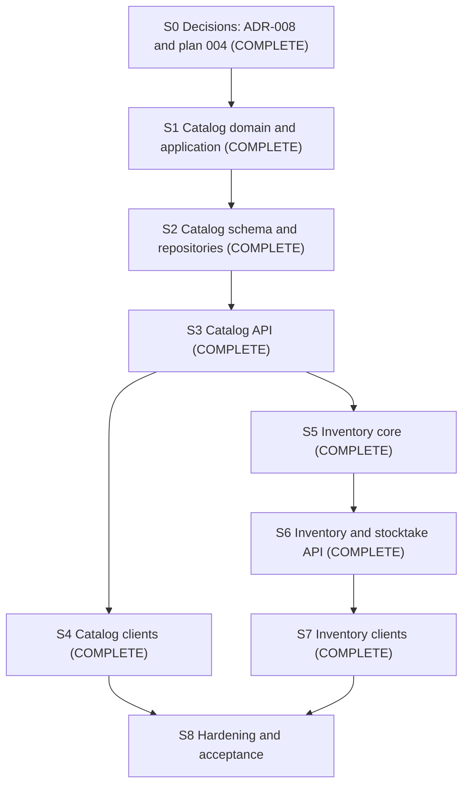

# Tali Build 2: product catalog and inventory (plan)

Status: **PLAN APPROVED WITH CHANGES (2026-10-05); the changes are incorporated here. Slice 0 (decisions)
COMPLETE (2026-10-05).** The design is recorded in `docs/decisions/ADR-008-catalog-quantity-inventory.md`,
**ACCEPTED (2026-10-05)** by the human maintainer. **Slice 1 (catalog domain and application) COMPLETE
(2026-10-05)**, with all gates passed, pending human review (`docs/audits/build-2-slice-1.md`). **Slice 2 (catalog
schema and repositories) COMPLETE (2026-10-05)** (`docs/audits/build-2-slice-2.md`). **Slice 3 (catalog API and
shared contracts) COMPLETE (2026-10-05)**, with all gates passed, pending human review
(`docs/audits/build-2-slice-3.md`). **Slice 4 (catalog clients) COMPLETE (2026-10-06)**, with all gates passed,
pending human review (`docs/audits/build-2-slice-4.md`). **Slice 5 (inventory core) COMPLETE (2026-10-08)**, with
all gates passed, pending human review (`docs/audits/build-2-slice-5.md`). **Slice 6 (stocktake and inventory API)
COMPLETE (2026-10-09)**, with all gates passed, pending human review (`docs/audits/build-2-slice-6.md`). **Slice 7
(inventory clients) COMPLETE (2026-10-09)**, with all gates passed, pending human review
(`docs/audits/build-2-slice-7.md`). Slice 8 is not started. Where this plan
and an ADR differ, the ADR is authoritative (`AGENTS.md` section 4).

Scope: implementation steps 3 (product catalog) and 4 (inventory) of `docs/product/mvp-scope.md`, quantity-only.

Not in Build 2:

- sales, POS checkout, receivables, accounting journal entries, COGS, inventory valuation, unit cost and tax;
- purchasing, procurement and suppliers;
- promotions, loyalty and discounts;
- AI, voice, photo capture and WhatsApp;
- offline synchronization;
- AWS infrastructure.

## Slices and status

| Slice | Content                                                                                       | Status                         |
| ----- | --------------------------------------------------------------------------------------------- | ------------------------------ |
| 0     | ADR-008 (accepted), this plan, ADR index row, mvp-scope approved decision and narrowed open decision 9 | **COMPLETE** (2026-10-05; ADR-008 accepted) |
| 1     | Catalog domain and application: `Quantity`, units, Product/Variant/Category/Pack, identifiers, price history, use cases, permissions, audit actions | **COMPLETE** (2026-10-05; `docs/audits/build-2-slice-1.md`) |
| 2     | Catalog schema, migration, `verify-schema` expectations and repositories                      | **COMPLETE** (2026-10-05; `docs/audits/build-2-slice-2.md`) |
| 3     | Catalog API and shared contracts                                                              | **COMPLETE** (2026-10-05; `docs/audits/build-2-slice-3.md`) |
| 4     | Catalog clients (web and mobile)                                                              | **COMPLETE** (2026-10-06; `docs/audits/build-2-slice-4.md`) |
| 5     | Inventory core: movements, balances, opening, goods receipts, adjustments, write-offs, reversals, low-stock thresholds and the derived low-stock state (domain, application, schema, repositories) | **COMPLETE** (2026-10-08; `docs/audits/build-2-slice-5.md`) |
| 6     | Stocktake (domain, application, schema) and the inventory API, including threshold endpoints  | **COMPLETE** (2026-10-09; `docs/audits/build-2-slice-6.md`) |
| 7     | Inventory clients (web and mobile), including threshold management and the LOW STOCK indicator | **COMPLETE** (2026-10-09; `docs/audits/build-2-slice-7.md`) |
| 8     | Hardening and final acceptance                                                                | Not started                    |

## 1. Delivery sequence

- Each slice is a separate PR on its own branch. Nothing is committed or pushed without the maintainer's instruction.
- S4 may run in parallel with S5 once S3 is merged.
- **Inventory core (S5) does not start until catalog S1 to S3 are merged and stable** (no open defects in their
  contracts).

## 2. Repository findings

- **Build 1 patterns reused unchanged:**
  - permission catalogue and role mapping (`packages/application/src/modules/identity/permissions.ts`,
    `definePermissionCatalogue`, `requireContextPermission`);
  - audit actions with ADR-006 fields (`defineAuditAction`, `auditField`, `tali-audit-registry.ts`);
  - keyed business-scoped idempotency (`KeyedIdempotency.runBusinessScoped` with a result codec; examples in
    `modules/device/devices.ts` and `modules/business/invitations.ts`);
  - `UnitOfWork.run` (read-committed, 5 s `lock_timeout`, up to 3 attempts), with row locks as parameterized
    `SELECT ... FOR UPDATE` in repositories;
  - `resolveDefaultLocation`, which returns a `LocationBoundContext`;
  - multi-file Prisma schema (`packages/database/prisma/schema/*.prisma`), migrations
    (`prisma/migrations/<timestamp>_<name>/migration.sql`) and `scripts/verify-schema.mjs` expectations (CHECKs,
    partial uniques, tenant FKs, privileges, no-delete and protected tables);
  - composite `(business_id, x_id)` FKs;
  - Zod HTTP contracts in `packages/shared/src/contracts/http/`, money on the wire as an integer string;
  - routes under `v1/businesses/:businessId/...` with the Authentication, BusinessContext and DeviceContext guards;
  - ESLint `PROTECTED_MODEL_DELEGATES` and `NO_DELETE_MODEL_DELEGATES`, and dependency-cruiser module public-surface
    rules.
- **Gaps Build 2 fills:**
  - no `Quantity` value object;
  - `auditField.integer` is limited to safe integers, so a bounded integer-string field kind is needed;
  - the audit entity-type union has no catalog or inventory types;
  - no product, catalog or inventory code, tables or screens.
- **Mobile:** the only local storage is SecureStore (Cognito session, Device credentials). Tests ban SQLite, MMKV and
  AsyncStorage for app data, so there is no offline catalog cache and Build 2 adds none.
- **Governing-document alignment:**
  - Build 2 uses the canonical movement names (`OPENING`, `PURCHASE_RECEIPT`, `ADJUSTMENT`, `WRITE_OFF`,
    `COUNT_CORRECTION`), not new names.
  - Variants exist because the APPROVED Core MVP and the canonical movement shape reference them.
  - Cost price (APPROVED "where known") is **not** in Build 2 (see section 7).
  - The low-stock indicator (APPROVED Core MVP inventory) **is** in Build 2, deliberately narrow (ADR-008 section 7.4).

## 3. Agreed domain model (ADR-008)

- **Catalog:**
  - `Product` (name, description, optional category, status, version);
  - exactly one hidden default `ProductVariant` per product, holding the optional SKU, optional barcode, stock unit,
    `trackInventory`, current selling price and `priceVersion`;
  - flat optional `ProductCategory`;
  - `ProductPack`: a named integer conversion to the stock unit, used for data entry only, with **no barcode**.
- **Units:**
  - the stock unit is the smallest practical unit the merchant transacts individually;
  - initial seed: `PIECE`, `BOTTLE`, `SACHET`, `TIN`, `PACK` (COUNT, scale 0), `KG` (MASS, 3), `G` (MASS, 0), `L`
    (VOLUME, 3) and `ML` (VOLUME, 0);
  - `CARTON`, `CRATE`, `BAG`, `DOZEN` and `BUNDLE` are pack names;
  - the list is not closed;
  - there is no unit conversion except pack to stock unit;
  - the unit is immutable once movements exist.
- **Quantity:** `bigint` minor quantity plus a unit code. In the database, `BIGINT` with bounds. On the wire,
  `{ quantityMinor: "<int>", unit }`, or a decimal string in stock units with excess precision rejected, or packs.
- **Identifiers:**
  - SKU is optional, normalized, and unique per business across all statuses.
  - Barcode is variant-only and optional. A valid GTIN of length 8, 12, 13 or 14 becomes GTIN-14. Anything else that
    passes the general syntax, including GTIN-looking codes with a bad check digit, is an ordinary merchant barcode.
  - Barcodes are unique among ACTIVE variants per business. Reactivating an archived product returns `409` if its
    barcode is now taken.
- **Inventory:**
  - append-only `inventory_movements`;
  - transactional `inventory_balances`, with a rebuild check;
  - documents `inventory_opening_batches`, `goods_receipts`, `inventory_adjustments` (kind `ADJUSTMENT` or
    `WRITE_OFF`) and `stocktakes` with `stocktake_lines`;
  - **typed nullable source FKs** on movements, with CHECKs tying each movement type to exactly one source;
  - `reverses_movement_id` is a composite self FK.
- **Low-stock indicator:**
  - configuration table `inventory_stock_thresholds`, keyed by business, location and variant
    (`low_stock_threshold_minor` nullable, `version`, timestamps); not on the variant (stock is per location) and not
    on the balance (a rebuildable projection);
  - threshold in the variant's current stock unit, exact `Quantity` rules, 0 or more, `NULL` when not configured;
  - derived on read: `LOW_STOCK` when the variant is ACTIVE and tracked, a threshold is configured, and on-hand is at
    most the threshold (threshold 0 flags zero on-hand); never for archived or untracked variants;
  - set and clear are state-setting configuration with `expectedVersion`; no movement is created;
  - a stock-unit change (allowed only before any movement) is rejected while any threshold is configured for the
    variant; the threshold is cleared and re-entered, never converted.
- **Policies:**
  - manual decreases cannot go below zero (`INSUFFICIENT_STOCK`);
  - counts set stock to the counted quantity;
  - no cost or valuation;
  - selling price per stock unit, business-wide, with append-only history;
  - archive, never delete;
  - archived variants with non-zero stock stay visible to inventory and stocktake flows.
- **Stocktake:**
  - one DRAFT per location, partial counts;
  - a **blind-count workflow**: expected quantities are omitted for actors without `inventory:count-post`, to reduce
    anchoring. It is not a security or confidentiality boundary, because STOCK_KEEPER keeps `inventory:read`;
  - posting order: lock, **POSTED returns the existing result**, then the version check, then staleness, then
    `COUNT_CORRECTION` for non-zero variances.
- **Permissions:**
  - `product:read`, `product:manage`, `product:price`;
  - `inventory:read`, `inventory:opening`, `inventory:receive`, `inventory:adjust`, `inventory:count`,
    `inventory:count-post`, `inventory:threshold`;
  - ten permissions in total, mapped as in ADR-008 section 15. `inventory:threshold` is held by OWNER, MANAGER and
    STOCK_KEEPER, not by CASHIER or ACCOUNTANT.

## 4. Slice details, acceptance gates and stop conditions

Every slice ends with:

- `pnpm verify` = 0 and `pnpm test:integration` = 0, each run alone with no other verify, build or test process
  running;
- gitleaks (CI `git` scan, plus `dir` on changed files) clean;
- a slice audit in `docs/audits/build-2-slice-N.md`.

A failure is investigated to a root cause and never dismissed as machine load. A retry is allowed only for a proven
process-startup or resource failure in which no assertion failed, and it is documented.

**Stop conditions for every slice:**

- a check fails without a documented root cause;
- a governing-document conflict;
- a need for a new dependency, datastore, service or provider (needs review or an ADR);
- any need for cost, valuation, tax or `SALE` behaviour (needs ADR-009 or ADR-010);
- any cross-tenant finding;
- any change to an accepted ADR.

### S0. Decisions (documents only): COMPLETE (2026-10-05)

- Content: ADR-008 (ACCEPTED 2026-10-05), this plan, the `docs/decisions/README.md` index row, and in
  `mvp-scope.md` the approved "Inventory quantities, units and packs" decision (by reference to ADR-008), open
  decision 9 narrowed to commercial pack semantics, and open decision 6 annotated as unchanged (ADR-008 section 24).
- Gate: Prettier, text integrity and `git diff --check` clean; **human acceptance of ADR-008**. All met on
  2026-10-05: ADR-008 was accepted by the human maintainer after AI-assisted design and review, with no changes that
  alter later slices.
- Outcome: Build 2 implementation is authorized to proceed to Slice 1. Slice 1 is not started.
- Accepted clarifications carried into S5 and S6 (ADR-008 sections 7.4 and 3.2): an absent threshold row is
  configuration version 0, and two concurrent initial creates produce exactly one winner; the stock-unit-change
  guard covers configured thresholds at every location of the business.

### S1. Catalog domain and application: COMPLETE (2026-10-05)

- Outcome: all gates passed (`pnpm verify` and `pnpm test:integration` exit 0, gitleaks clean); audit in
  `docs/audits/build-2-slice-1.md`. Review correction applied: `expectedVersion` is checked before no-op detection
  (ADR-008 section 9). Accepted by the human maintainer: stock-unit change blocked while ACTIVE packs exist;
  RetirePack without `expectedVersion`; `VERSION_CONFLICT` mapped to 409 in the API error map.

- Content:
  - the `Quantity` kernel value object and unit reference model;
  - Product, Variant, Category and Pack entities and invariants;
  - SKU normalization;
  - barcode syntax and GTIN check-digit normalization;
  - price history;
  - use cases with in-memory fakes;
  - permissions added to the catalogue and role mapping;
  - catalog audit actions, the integer-string audit field kind and the entity types.
- Gate:
  - unit tests for each mutation's success, validation failure, idempotent replay and key reuse, unauthorized tenant,
    insufficient permission, version conflict and audit content;
  - property tests for quantity parsing (excess precision rejected, bounds, round trips), SKU normalization and GTIN
    handling (valid GTIN to GTIN-14; GTIN-length code with a bad check digit kept as an ordinary code);
  - currency mismatch rejected, with tests using at least one non-NGN currency and different minor digits;
  - the registry redaction test covers the new actions.
- Stop: if the audit field kind needs an ADR-006 change, stop and raise it.

### S2. Catalog schema and repositories: COMPLETE (2026-10-05)

- Outcome: all gates passed (`pnpm verify` and `pnpm test:integration` exit 0, verify-schema and drift clean,
  gitleaks clean); audit in `docs/audits/build-2-slice-2.md`. Review correction applied:
  `product_variants_default_only CHECK (is_default = true)` with the partial default index, so a Build 2 product has
  at most one variant row and it is the default (ADR-008 section 3.2). Interpretations approved by the human review.
  At S2, `DatabaseRepositories` had no production `VariantInventoryStateReader`. Approved for S3: the API composition
  could use a visibly temporary `PreInventoryStateReader` (outside `packages/database`) returning no movements and a
  zero balance, truthful only while no inventory tables existed, and S5 had to delete or replace it with the
  inventory-backed reader. **Done in S5:** the temporary reader is deleted and the database-backed
  `variantInventoryState` reader is in production composition.

- Content:
  - migration for `units_of_measure` (seed), `product_categories`, `products`, `product_variants`, `product_packs` and
    `product_variant_prices`;
  - `UNIQUE (businesses.id, currency_code)` for the price currency FK;
  - composite FKs, CHECKs, partial uniques (default variant, active barcode, active category name, active pack name)
    and SKU uniqueness;
  - grants: no DELETE anywhere; price history INSERT and SELECT only;
  - `verify-schema.mjs` expectations;
  - ESLint no-delete and protected lists;
  - repositories (every method takes `businessId`).
- Gate:
  - database integration tests for every constraint;
  - concurrent duplicate-SKU and duplicate-active-barcode races (exactly one wins);
  - barcode reuse after archive and the reactivation conflict;
  - privilege checks;
  - cross-tenant FK rejection.
- Stop: a constraint ADR-008 requires cannot be expressed, until the ADR is amended or the design changes.

### S3. Catalog API: COMPLETE (2026-10-05)

- Outcome: all gates passed (`pnpm verify` and `pnpm test:integration` exit 0, gitleaks clean); audit in
  `docs/audits/build-2-slice-3.md`, pending human review. No schema change, no new dependency. Through S3 and S4 the
  API composition used the temporary `PreInventoryStateReader` (no I/O, UpdateProduct only), with gate tests that
  failed if any inventory table, module or route appeared. The S3 obligation to delete or replace it with the real
  movement- and balance-backed implementation was met in S5 (see the S5 outcome).

- Content:
  - shared Zod contracts (`catalog.ts`, `quantity.ts`);
  - controllers under `v1/businesses/:businessId/products`, `.../categories` and `.../products/:productId/packs`;
  - price endpoints;
  - search by name, SKU and barcode;
  - paginated lists with a default `status=ACTIVE` and explicit archived filters;
  - `Idempotency-Key` on keyed creates;
  - `expectedVersion` on edits.
- Gate:
  - API end-to-end tests (Supertest, real PostgreSQL) for 401, 403 (wrong role) and cross-tenant 404;
  - validation `400` with unknown fields rejected;
  - replay with `Idempotent-Replayed`, key reuse `409`, version conflict `409`;
  - quantities and money never JSON numbers (contract tests);
  - the route inventory test updated.
- Stop: a breaking change to an existing public contract.

### S4. Catalog clients: COMPLETE (2026-10-06)

- Outcome: all gates passed (Playwright 11 passed, client-bundle scan clean, `pnpm verify` and
  `pnpm test:integration` exit 0, gitleaks clean); audit in `docs/audits/build-2-slice-4.md`, pending human review.
  One additive read route (`GET .../currency`); no schema change, no new dependency; `PreInventoryStateReader`
  unchanged in S4 (deleted in S5).

- Content:
  - web pages: list, search, create, edit, archive and reactivate, price, categories, packs;
  - mobile screens: list, search, typed barcode entry, create, edit, archive, price;
  - display formatting of quantities and money only.
- Gate:
  - Vitest and Jest component tests, Playwright for the web flows;
  - client-bundle scan clean;
  - no client import of domain code beyond allowed kernels;
  - no authoritative arithmetic in clients.
- Stop: camera barcode scanning or any new native dependency is requested (dependency review first).

### S5. Inventory core: COMPLETE (2026-10-08)

- Outcome: all gates passed (`pnpm verify` and `pnpm test:integration` exit 0; migrate status, drift, verify-schema
  and the inventory consistency check clean before and after integration; `pnpm boundaries` clean; gitleaks clean);
  audit in `docs/audits/build-2-slice-5.md`, pending human review. No new dependency; no HTTP route; no client UI.
  - inventory domain and application: the four Slice 5 movement types, the negative-stock rule, reversals, eight
    use cases with the seven inventory permissions and eight audit actions, and a state-independent keyed `plan()`
    with all locks and decisions in `apply()` after the idempotency claim;
  - six tables (`inventory_opening_batches`, `goods_receipts`, `inventory_adjustments`, `inventory_movements`,
    `inventory_balances`, `inventory_stock_thresholds`): append-only movements with typed sources and a
    version-guarded balance projection, tenant-composite FKs, column-level reversal grants, no DELETE;
  - low-stock thresholds and the pure low-stock derivation (read-time use in S6);
  - the production `VariantInventoryStateReader` replaces the deleted `PreInventoryStateReader`, and UpdateProduct
    rejects a stock-unit change while a threshold is configured at any location; the catalog API guard is proven end
    to end against real inventory;
  - the consistency query and read-only operator script, and the database concurrency suite;
  - the dependency-cruiser rule `ai-no-catalog-inventory` (reachability, so the `@tali/application` root cannot be
    used as a bypass).
  - Human-confirmed D1 (Option A): `COUNT_CORRECTION`, `stocktake_id`, the stocktake-line FK and the extended
    movement constraints arrive with stocktakes in S6.

- Content:
  - domain and application for movements, balances, opening batches, goods receipts, adjustments, write-offs, and
    reversals of receipts and adjustments;
  - lock ordering;
  - the negative-stock rule;
  - migration for `inventory_balances`, `inventory_movements`, `inventory_opening_batches`, `goods_receipts` and
    `inventory_adjustments`, with typed source FKs and CHECKs, direction CHECKs, the reversal self FK and UNIQUE, the
    one-`OPENING` partial unique and column-level reversal grants;
  - repositories;
  - the consistency check query and operator script;
  - inventory permissions (including `inventory:threshold`) and audit actions (including
    `inventory.low_stock_threshold_set` and `inventory.low_stock_threshold_cleared`);
  - the low-stock threshold: `inventory_stock_thresholds` migration (nullable threshold, `CHECK` 0 to 10^15, unique
    business, location and variant, composite FKs, no DELETE grant), repository, the SetLowStockThreshold and
    ClearLowStockThreshold use cases, the pure low-stock derivation function, and the stock-unit-change rejection
    while a threshold is configured (in the catalog use case, added in this slice).
- Gate, for every mutation:
  - the six mandatory cases (`60-testing.mdc`): success, validation failure with nothing persisted, duplicate request
    with one effect, unauthorized tenant, reversal restoring stock and referencing the original, and audit content;
  - plus insufficient permission, invalid transition (reversing twice is a no-op; reversing an opening is rejected),
    `INSUFFICIENT_STOCK`, archived and untracked variants rejected where required, and pack entry producing exact
    deltas;
  - **concurrency:** two simultaneous decrements cannot oversell; multi-line documents with overlapping variants in
    opposite order do not deadlock; a concurrent archive and receipt serialize correctly;
  - **balance equals the sum of movements, and version equals the movement count, after every scenario;**
  - database tests prove each source CHECK and FK rejects a mismatched type or source, a cross-tenant source and a
    cross-variant pack.
- Gate, low-stock threshold (domain, application and database tests):
  - threshold absent: no low-stock state;
  - threshold 0: zero on-hand is low stock, positive on-hand is not;
  - on-hand above, equal to and below the threshold;
  - a negative threshold, a float or an excess-precision value is rejected;
  - unauthorized threshold update (CASHIER, ACCOUNTANT) is denied;
  - location isolation: a threshold at one location does not affect another (database-level test with two
    locations);
  - cross-tenant protection: business A cannot read or change business B's thresholds;
  - optimistic version conflict on a stale `expectedVersion`;
  - version 0: an initial set with `expectedVersion = 0` inserts version 1; `expectedVersion = 0` against an existing
    row (including a cleared one) is `409 VERSION_CONFLICT`; two concurrent initial creates produce exactly one
    winner and one `409 VERSION_CONFLICT` (database-level concurrency test);
  - setting the same value, or clearing an absent threshold, is a no-op with no audit record;
  - setting or clearing creates no movement and changes no balance;
  - audit payloads carry from and to thresholds as integer strings and no stock history;
  - a stock-unit change is rejected while a threshold is configured at any location of the business (including a
    location other than the resolved default, set up directly in the database test), and allowed after every
    threshold is cleared; no threshold is converted;
  - an archived variant with residual stock is not flagged low stock; an untracked variant is never flagged.
- Stop: any need for cost or `SALE`, or any request to add alerts, forecasting or reorder suggestions (out of
  Build 2).

### S6. Stocktake and inventory API: COMPLETE (2026-10-09)

- Outcome: all gates passed (`pnpm verify` exit 0 on an unchanged retry after a web worker start-up failure, and
  `pnpm test:integration` exit 0; migrate status, drift, verify-schema and the inventory consistency check clean
  before and after integration; `pnpm boundaries` clean; gitleaks clean); audit in `docs/audits/build-2-slice-6.md`,
  pending human review. No new dependency; no client UI.
  - stocktake domain and application (create, count, remove, post, cancel), `COUNT_CORRECTION` planning, the
    `STOCKTAKE_STALE` error with bounded details, and the item, balance, movement and stocktake reads;
  - one atomic forward-only migration (explicit `BEGIN`/`COMMIT`, proven against a failure-injected copy):
    `stocktakes`, `stocktake_lines`, the one-DRAFT-per-location partial unique, the movement `stocktake_id` with
    composite FKs to the line and header, and the replaced and new movement CHECKs;
  - exactly 22 inventory HTTP routes behind the authentication, business and device guards, with no client
    location; BLIND stocktake lines never carry `expectedAtCount` or `variance`;
  - business and location isolation and the nine concurrency scenario groups pass on a single attempt with no
    deadlock.

- Content:
  - stocktake domain, application and schema (`stocktakes`, `stocktake_lines`, the one-DRAFT-per-location partial
    unique);
  - the count, remove, post and cancel use cases;
  - the inventory API: balances (ACTIVE tracked variants and archived variants with non-zero stock, with the
    threshold, the derived `lowStock` flag and a `lowStock=true` filter), the inventory item search for cleanup flows,
    paginated movement history, documents, opening, receipts, adjustments, write-offs, reversals and stocktakes;
  - threshold endpoints: set (with `expectedVersion`) and clear, under `inventory:threshold`.
- Gate:
  - partial count (uncounted variants untouched);
  - zero variance creates no movement;
  - a stale line returns `STOCKTAKE_STALE` with nothing written;
  - **a posting retry after success returns the posted result even though the version changed;**
  - a cancelled stocktake cannot be posted;
  - blind-count workflow field filtering by permission (expected quantities omitted from stocktake responses for
    actors without `inventory:count-post`; the tests do not claim balances are hidden elsewhere);
  - threshold API end-to-end tests: 401, 403 for CASHIER and ACCOUNTANT, cross-tenant 404, version conflict `409`,
    validation `400` (negative, float JSON number, excess precision), the `lowStock` flag and filter, and archived
    residual-stock items listed with `lowStock = false`;
  - concurrent counters on the same line produce a version conflict, not a silent overwrite;
  - the residual-stock visibility tests;
  - every API end-to-end case from S3.
- Stop: the staleness rule proves unusable in pilot walkthroughs (revise the ADR rather than weaken it silently).

### S7. Inventory clients: COMPLETE (2026-10-09)

- Outcome: all gates passed (`pnpm verify` exit 0 after a format fix and an unchanged retry of a host-load mobile test
  timeout, and exit 0 again on the final tree; `pnpm test:integration` exit 0; web Playwright 12 and 5 passed,
  including `inventory.spec.ts` against the real API; client bundle check clean; Expo Android export exit 0;
  `pnpm boundaries` clean; gitleaks clean); audit in `docs/audits/build-2-slice-7.md`, pending human review. No new
  dependency; no server, schema or migration change.
  - web and mobile inventory over the 22 Slice 6 routes, every response validated with the shared schemas;
  - LOW STOCK from the API flag only, never for archived items; threshold controls hidden without
    `inventory:threshold`; version conflicts shown and reloaded, never retried;
  - BLIND counters never see `expectedAtCount` or `variance`; `STOCKTAKE_STALE` marks the stale lines and reloads
    without resubmitting;
  - keyed commands keep their idempotency key across uncertain retries; no `locationId`, no client stock arithmetic,
    no persistence.

- Content: web and mobile stock list (with archived residual stock labelled), movement history, receive, adjust and
  write off, reversals, opening stock, the stocktake count, review and post flow, setting and clearing the low-stock
  threshold on the inventory item screen (for `inventory:threshold` holders), and a simple LOW STOCK indicator on the
  stock list.
- Gate:
  - component and Playwright tests;
  - the LOW STOCK indicator is rendered from the API flag only (no client derivation), never for archived items, and
    the threshold controls are hidden or disabled without `inventory:threshold`;
  - client-bundle scan clean;
  - `expectedAtCount` never rendered for counters;
  - no client-side stock arithmetic beyond display.
- Stop: as S4.

### S8. Hardening and acceptance

- Content:
  - audit coverage review (every mutation writes exactly one record, no-ops none);
  - a concurrency soak in database tests;
  - a tenancy and permission security review;
  - a dependency-cruiser check that no AI or other module reaches inventory repositories;
  - low-stock acceptance: end to end, an authorized role sets a threshold, stock moves across it through receipts and
    adjustments, the LOW STOCK indicator appears and clears on web and Android, and an archived item with residual
    stock stays visible without the indicator;
  - a reference Android device walkthrough of the catalog and inventory flows on the debug APK (release readiness not
    claimed);
  - the final Build 2 audit.
- Gate: all of the above recorded, and the slice-ending checks.
- Stop: any unexplained failure or cross-tenant finding.

## 5. Expected file families (later slices only)

- Domain:
  - `packages/domain/src/kernel/quantity.ts` (with tests);
  - `packages/domain/src/modules/catalog/`;
  - `packages/domain/src/modules/inventory/`.
- Application:
  - `packages/application/src/modules/catalog/` and `packages/application/src/modules/inventory/` (use cases, ports,
    audit actions, codecs);
  - changes to `modules/identity/permissions.ts`, `audit/audit-payload.ts`, `audit/audit-action.ts` and
    `audit/tali-audit-registry.ts`;
  - in-memory fakes in `src/testing/`.
- Database:
  - `packages/database/prisma/schema/catalog.prisma` and `inventory.prisma`;
  - migrations under `prisma/migrations/`;
  - repositories under `src/repositories/`;
  - `scripts/verify-schema.mjs`;
  - an inventory consistency check script;
  - tenancy fixtures.
- Shared: `packages/shared/src/contracts/http/catalog.ts`, `inventory.ts` and `quantity.ts`.
- API: `apps/api/src/catalog/` and `apps/api/src/inventory/` controllers, composition wiring, end-to-end tests.
- Web: `apps/web/src/catalog/` and `apps/web/src/inventory/` with `app/` routes, plus Playwright specs.
- Mobile: `apps/mobile/src/catalog/` and `apps/mobile/src/inventory/` with `app/` routes and tests.
- Tooling:
  - `tooling/eslint/index.mjs` (protected and no-delete models);
  - `.dependency-cruiser.cjs` (module surfaces, an AI-to-inventory ban);
  - `tooling/client-bundle-check` only if new canaries are needed.
- Docs: `docs/audits/build-2-slice-N.md`.

## 6. Dependencies

- **ADR-008 accepted by a human maintainer** before Slice 1: met on 2026-10-05.
- **ADR-009** (ledger posting foundation, chart of accounts and inventory valuation; accounting review) accepted
  before any unit cost, valuation, COGS, journal entry or `SALE` movement, and before Build 3 implementation.
- **ADR-010** (configurable tax treatment; accounting review) before tax on sale lines.
- The sync ADR before the offline catalog view and offline inventory commands.
- No new runtime dependency is planned. Any proposed dependency (for example camera barcode scanning) is reviewed
  first.

## 7. MVP items deliberately outside Build 2

These APPROVED Core MVP items are deferred, not dropped. Each needs a later slice, build or decision:

- cost price where known (ADR-009);
- the multi-variant catalog UI;
- the offline catalog view and offline-queued inventory operations (sync ADR);
- pack selling and pack prices (Build 3);
- pack barcodes (shared identifier registry);
- transfers (post-MVP).

Explicitly out of Build 2 and not implied by the low-stock indicator: notifications, push alerts, forecasting,
automatic reorder points, reorder quantities, supplier recommendations, automatic purchasing and AI-generated restock
orders.

Open decision 9 is only partially resolved by ADR-008: commercial pack semantics (selling by pack, pack prices,
purchasing cost by pack, transaction-line pack selection and snapshots) remain open for Build 3 and purchasing.

## 8. Risks

- Merchants may expect to sell whole cartons before Build 3.
- The seed unit list may miss local measures; adding units needs a migration and evidence of an exact conversion.
- Quantity-only history needs an opening valuation when ADR-009 introduces costing.
- The stocktake staleness rule may cause recounts in busy shops once sales exist.
- The blind-count workflow reduces anchoring but is not a security boundary: STOCK_KEEPER keeps `inventory:read` and
  can view balances elsewhere.
- Low-stock thresholds are per location; when further locations arrive, each needs its own thresholds (no copying
  is implied).
- A merchant who wants to change a stock unit must first clear its thresholds; the UI must explain the `409`.
- Barcode release on archive plus the reactivation `409` may confuse users; the UI must explain it.
- There is no offline catalog until the sync build, which is a known gap against the MVP offline goals.
- Audit payloads are summaries; per-line evidence is in the movements, so audit review tooling must read both.
- Mobile Metro and watcher instability seen in Build 1 can slow client slices; the operational note in
  `docs/audits/build-1-slice-6.md` applies.
